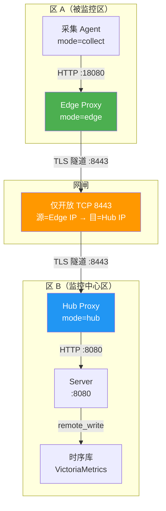

## 用户需求

在 nebula-monitor 项目中实现 Agent 代理方案（网闸隔离双网区场景），同时提供 Web 端 Agent 安装引导页，并更新 README。

### 产品概述

针对两个通过网闸隔离、无法直接互访的网区监控需求，在现有 Agent 二进制内扩展三种运行模式（collect/edge/hub），构成网闸隧道，使采集 Agent 的上报数据可穿透网闸到达 Server。同时在 Web 端新增 Agent 安装引导页，引导用户快速部署 Agent，含直连场景一行命令展示与网闸代理场景的配置向导。

### 核心功能

1. **Agent 代理模式（Go 后端）**：Agent 二进制新增 `mode=collect|edge|hub` 配置项；edge 模式在区 A 边界监听本地口汇聚采集 Agent 上报，通过 TLS 隧道转发至 hub；hub 模式在区 B 边界接收隧道连接，还原请求转发至真实 Server；含连接管理、消息转发、心跳检测、断线重连、本地缓冲、mTLS 鉴权、自监控指标
2. **Web 安装引导页（Vue3 前端）**：新增 `/setup` 页面，展示当前 Server 地址 + 可填写节点名/分组/密钥的 curl|bash 一行安装命令（实时回填、一键复制）；加"网闸场景"折叠区，填 Edge/Hub 部署信息后生成两侧 agent.yaml 模板与安装命令
3. **Server 端 API 补充**：新增 `/api/v1/install-info` 扩展返回代理模式配置模板；新增 `/api/v1/proxy/status` 端点查看已注册代理连接状态
4. **安装脚本扩展**：`agent-install.sh` 增加 `--mode edge|hub` 参数与对应配置生成逻辑
5. **README 更新**：追加网闸代理部署章节与 Agent mode 配置说明，同步功能清单/配置项/API/目录结构
6. **版本发布**：bump VERSION → 提交 git → release.sh 打包

## Tech Stack

- 后端：Go 1.24（`crypto/tls`、`net/http`、`sync`、`log/slog`）
- 前端：Vue 3 + Element Plus + Vite（现有技术栈）
- 构建：`build/cross-compile.sh` + `build/release.sh`（现有流程，VERSION 单一来源）
- 部署：`deploy/agent-install.sh` 扩展

## Implementation Approach

### 核心策略

在现有 Agent 二进制内扩展代理模式，复用 `reporter`、`upgrader`、鉴权与安装体系，不另起程序。Agent `main.go` 根据 `cfg.Mode` 分流到三条启动路径：

- **collect 模式**（默认，现状不变）：采集 + HTTP 上报到 `serverURL`（直连 Server 或指向 Edge 本地口）
- **edge 模式**：启动本地 HTTP 监听口（汇聚采集 Agent 上报）+ 主动拨出 TLS 隧道到 Hub，双向转发请求/响应
- **hub 模式**：启动 TLS 监听口（接收 Edge 隧道连接）+ 本地 HTTP 客户端转发到真实 Server，双向转发请求/响应

### 隧道协议设计

Edge↔Hub 之间采用**长连接多路复用 HTTP 隧道**协议：

- Edge 作为 HTTP 客户端，主动向 Hub 发起 TLS 连接（`POST /proxy/tunnel`），保持长连接
- 每条隧道连接上，Edge 收到本地采集 Agent 的上报请求后，通过隧道以 `X-Proxy-Frame: data` 头封装原始 HTTP 请求体转发；Hub 解封装后发起新 HTTP 请求到真实 Server
- 响应沿同一条隧道连接原路返回（`X-Proxy-Frame: resp` + 状态码 + 响应体）
- 心跳帧 `X-Proxy-Frame: ping` 每 15s 一次，超时 45s 判定断连
- 断连期间 Edge 将上报请求入内存环形缓冲（默认 1000 条），重连后补发

### 关键技术决策

1. **复用 Agent 二进制而非新建程序**：降低维护成本，复用 reporter/upgrader/鉴权/安装体系，运维只需一套流程
2. **mTLS 双向证书校验**：网闸即使放行也看不到业务数据，TLS 1.3 深度检测友好
3. **内存缓冲而非磁盘缓冲**：网闸抖动通常秒级恢复，内存缓冲足够且实现简单；配置项 `bufferSize` 可调
4. **单端口隧道**：网闸仅需开放 1 个 TCP 端口（默认 8443），降低网闸策略复杂度
5. **自监控指标复用现有上报通道**：Edge/Hub 自身的 proxy_* 指标通过自身上报或经隧道上报 Server，纳入现有告警

### 性能与可靠性

- 隧道连接池：Edge 维护到 Hub 的 1~3 条并发隧道连接（可配置），避免单连接阻塞
- 请求超时：单请求转发超时 30s（与 reporter 的 10s + 退避兼容）
- 缓冲削峰：内存环形缓冲，满时丢弃最旧请求并计数 `proxy_dropped_total`
- 重连退避：指数退避（base 2s，cap 60s）+ 随机抖动，避免重连风暴

## Implementation Notes

- **复用现有模式**：Agent Config 结构追加 `Mode` 字段，默认 `collect` 确保向后兼容；`main.go` 按 Mode 分流
- **鉴权复用**：隧道内层请求原样携带 `X-Agent-Secret`，Hub 透传不做二次校验（由真实 Server 的 receiver 校验）；隧道外层 mTLS 由 Edge/Hub 双向证书校验
- **Server 无感知**：Hub 对 Server 完全透明，复用现有 `/api/v1/report` 等接口，**无需改 Server receiver 逻辑**
- **安装脚本扩展**：`agent-install.sh` 新增 `--mode` 参数与 `--hub-addr`/`--hub-port`/`--listen`/`--tls-cert`/`--tls-key`/`--tls-ca` 参数；mode=edge/hub 时生成对应 agent.yaml 与 systemd 单元
- **前端构建**：新增 `SetupView.vue` 后需 `cd web && npm run build`，由 `release.sh` 自动处理
- **版本号**：bump VERSION 到 1.13.0（代理方案是重要功能，minor 版本递增），通过 `build/release.sh` 统一构建
- **日志**：复用 `slog` JSON handler；隧道连接/断连/重连/鉴权失败用 `slog.Info`/`slog.Warn`，不记录请求体（防敏感信息泄露）
- **blast radius**：mode=collect 为默认值，不影响现有部署；代理模式为可选功能，不启用时零影响

## Architecture Design



## Directory Structure

```
nebula-monitor/
├── cmd/agent/
│   └── main.go                          # [MODIFY] 按 cfg.Mode 分流到 collectRun/edgeRun/hubRun
├── internal/agent/
│   ├── config/
│   │   └── config.go                    # [MODIFY] 新增 Mode/Proxy 字段（ProxyConfig 含 Listen/HubAddr/HubPort/TLS 配置/BufferSize 等）
│   ├── proxy/                           # [NEW] 代理模式核心包
│   │   ├── tunnel.go                    # [NEW] 隧道协议：帧编解码（data/resp/ping/close）、多路复用读写
│   │   ├── edge.go                      # [NEW] Edge Proxy：本地 HTTP 监听 + 拨出 TLS 隧道到 Hub + 请求转发 + 缓冲重放
│   │   ├── hub.go                       # [NEW] Hub Proxy：TLS 监听接收隧道 + 还原请求转发到真实 Server + 响应回传
│   │   ├── connpool.go                  # [NEW] 连接管理：Edge 维护到 Hub 的多连接池、健康检查、空闲回收
│   │   ├── reconnector.go               # [NEW] 断线重连：指数退避 + 随机抖动 + 重连后缓冲补发
│   │   ├── buffer.go                    # [NEW] 内存环形缓冲：断连期间请求入队、恢复后重放、满时丢弃计数
│   │   ├── monitor.go                   # [NEW] 自监控指标：proxy_conn_active/proxy_forward_total/proxy_dropped_total/proxy_reconnect_total
│   │   └── tls.go                       # [NEW] mTLS 配置：加载证书/CA、构建 tls.Config（双向校验）
│   └── reporter/
│       └── reporter.go                  # [MODIFY] 无需改动（collect 模式上报逻辑不变；Edge/Hub 自监控复用 reporter 上报）
├── internal/server/
│   ├── api/
│   │   ├── query.go                     # [MODIFY] 新增 GET /api/v1/proxy/status 路由注册；扩展 handleInstallInfo 返回代理配置模板
│   │   └── proxy_api.go                 # [NEW] 代理状态查询 handler（列出已注册 Edge 连接、隧道活跃数、转发统计）
│   └── config/
│       └── config.go                    # [MODIFY] 无需改动（Server 不感知代理，Hub 直接转发到 Server listen 地址）
├── deploy/
│   └── agent-install.sh                 # [MODIFY] 新增 --mode edge|hub 参数 + --hub-addr/--hub-port/--listen/--tls-cert/--tls-key/--tls-ca；mode=edge/hub 时生成对应 agent.yaml 与 systemd 单元
├── web/src/
│   ├── components/
│   │   └── SetupView.vue                # [NEW] Agent 安装引导页：直连场景命令展示区 + 网闸代理场景向导折叠区
│   ├── router/
│   │   └── index.js                     # [MODIFY] 新增 { path: 'setup', name: 'setup', component: SetupView } 路由
│   └── components/
│       └── Sidebar.vue                  # [MODIFY] 导航栏新增"Agent 部署"菜单项
├── README.md                            # [MODIFY] 追加网闸代理部署章节、Agent mode 配置说明；同步功能清单/API/目录结构
└── VERSION                              # [MODIFY] 1.12.7 → 1.13.0
```

## Key Code Structures

### Agent Config 扩展

```
// internal/agent/config/config.go — 新增字段

type Config struct {
    // ... 现有字段不变 ...
    Mode  string      `yaml:"mode"`  // collect(默认) | edge | hub
    Proxy ProxyConfig `yaml:"proxy"` // 代理模式配置，mode=edge/hub 时生效
}

type ProxyConfig struct {
    Listen     string `yaml:"listen"`     // Edge: 本地汇聚监听口 ":18080"；Hub: TLS 监听口 ":8443"
    HubAddr    string `yaml:"hubAddr"`    // Edge: Hub 的地址 host:port（如 10.0.0.2:8443）
    ServerURL  string `yaml:"serverURL"`  // Hub: 真实 Server 地址（如 http://127.0.0.1:8080）
    TLSCert    string `yaml:"tlsCert"`    // TLS 证书文件路径
    TLSKey     string `yaml:"tlsKey"`     // TLS 私钥文件路径
    TLSCA      string `yaml:"tlsCa"`      // CA 证书文件路径（mTLS 双向校验）
    BufferSize int    `yaml:"bufferSize"` // Edge 断连时内存缓冲条数，默认 1000
    PoolSize   int    `yaml:"poolSize"`   // Edge 到 Hub 的并发隧道连接数，默认 2
}
```

### 隧道帧协议

```
// internal/agent/proxy/tunnel.go — 帧类型定义

type FrameType string

const (
    FrameData    FrameType = "data"    // Edge→Hub: 转发请求
    FrameResp    FrameType = "resp"    // Hub→Edge: 响应回传
    FramePing    FrameType = "ping"    // 心跳
    FrameClose   FrameType = "close"   // 主动关闭
)

type Frame struct {
    Type      FrameType `json:"type"`
    RequestID string    `json:"requestId"` // 请求 ID（多路复用匹配）
    Status    int       `json:"status,omitempty"`    // resp 帧的状态码
    Headers   map[string]string `json:"headers,omitempty"` // data 帧携带的原始请求头
    Body      []byte    `json:"body,omitempty"`      // 请求体或响应体
}
```

## Design Approach

新增 Agent 安装引导页（SetupView），采用与现有页面一致的暗色玻璃拟态风格，保持视觉统一。页面分为两大区块：直连场景安装命令展示区（默认展开）与网闸代理场景配置向导（折叠区，点击展开）。

### 页面区块设计

**区块 1：页面标题栏**

- 标题"Agent 部署引导" + 副标题说明
- 与其他页面一致的 page-wrap + section-title 竖线风格

**区块 2：直连场景安装命令（默认展开）**

- 表单区：节点名（默认 hostname）、分组（默认 default）、接入密钥（Server 启用 agentAuth 时显示）、采集间隔
- 命令展示区：实时拼接 `curl -fsSL http://<server>/install/agent-install.sh | bash -s -- --server http://<server> --node ... --group ... --secret ...`
- 一键复制按钮（el-button + clipboard）
- 连通性自检按钮：调用 `/api/v1/agent/check` 验证密钥是否被接受

**区块 3：网闸代理场景向导（折叠区）**

- 折叠标题"网闸场景：Edge/Hub 代理部署"
- 展开后两列表单：
- Edge Proxy 配置：监听地址、Hub 地址、TLS 证书/密钥/CA 路径、缓冲大小
- Hub Proxy 配置：TLS 监听地址、Server 地址、TLS 证书/密钥/CA 路径
- 生成区：
- Edge agent.yaml 模板（mode: edge + proxy 配置）
- Hub agent.yaml 模板（mode: hub + proxy 配置）
- 两侧安装命令（含 --mode edge/hub 参数）
- 每个代码块带复制按钮

**区块 4：部署说明**

- 简要步骤说明（1. 区 B 部署 Hub → 2. 区 A 部署 Edge → 3. 区 A 采集 Agent serverURL 指向 Edge 本地口）
- 端口规划说明（网闸开放 TCP 8443）

## Agent Extensions

### SubAgent

- **code-explorer**
- Purpose: 在实现阶段深入探索代理模式涉及的现有代码路径（reporter 上报流程、receiver 校验逻辑、agentdist 分发路由），确保隧道转发与现有上报链路无缝衔接
- Expected outcome: 确认 Edge 转发的请求格式与 Server receiver 预期完全一致，Hub 透传不丢失任何 header/body 字段