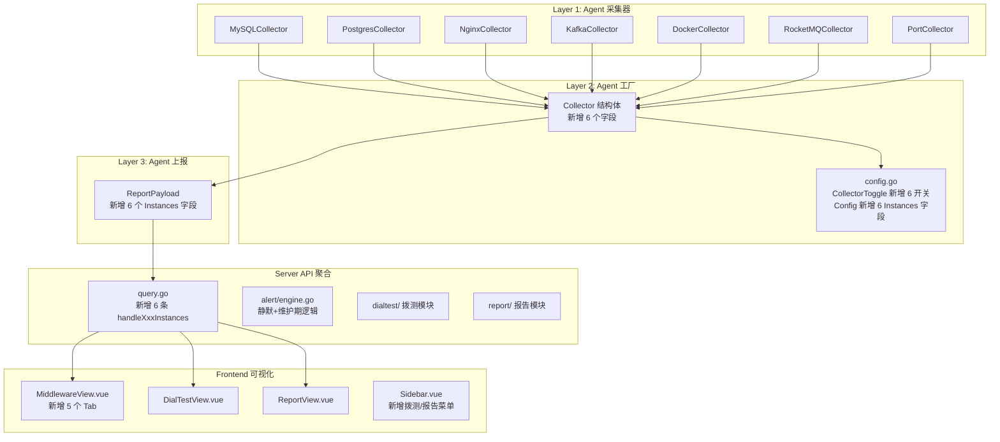

## 产品概述

为 nebula-monitor 一次性实现 10 个功能模块：5 个原有模块（MySQL 监控、告警静默/维护期、服务拨测、端口监控、报告生成）+ 5 个追加模块（PostgreSQL 监控、Nginx 监控、Kafka 监控、Docker 监控、RocketMQ 监控）。所有中间件监控模块完全复用 Redis 采集器已验证的三层架构：Agent 采集器（直连 + Prometheus exporter 双模式）→ Server API 聚合查询（QueryAllLatest 获取实例清单 → 批量查询指标 → 按 node|instance 匹配填充）→ 前端 MiddlewareView Tab 可视化（概览卡片 + 环形图 + 柱状图 + 实例列表 + 详情抽屉趋势图）。

## 核心功能

### 模块 1：MySQL 监控

- Agent 直连 MySQL 协议（go-sql-driver/mysql），执行 SHOW GLOBAL STATUS / SHOW SLAVE STATUS / SHOW VARIABLES，采集连接数、QPS、慢查询、InnoDB 缓冲池命中率、主从复制延迟、死锁、临时表等 22 项指标
- 支持 Prometheus exporter 双模式，产出 `mysql_instance_up` 存活指标
- Server 侧 GET /api/v1/middleware/mysql/instances 聚合 API
- 前端 MySQLTab 组件（6 区块布局），MiddlewareView.vue 启用 MySQL Tab

### 模块 2：PostgreSQL 监控

- Agent 直连 PostgreSQL（lib/pq），查询 pg_stat_database / pg_stat_bgwriter / pg_stat_replication / pg_stat_activity，采集连接数、事务、缓存命中率、死锁、复制延迟、WAL 等 20 项指标
- 支持 Prometheus exporter 双模式，产出 `postgres_instance_up` 存活指标
- Server 侧 GET /api/v1/middleware/postgres/instances 聚合 API
- 前端 PostgresTab 组件

### 模块 3：Nginx 监控

- Agent HTTP GET nginx stub_status 端点，解析 Active Connections / accepts / handled / requests / Reading / Writing / Waiting，产出 10 项指标
- 支持 VTS exporter 双模式，产出 `nginx_instance_up` 存活指标
- Server 侧 GET /api/v1/middleware/nginx/instances 聚合 API
- 前端 NginxTab 组件（连接状态堆叠图、RPS 趋势图）

### 模块 4：Kafka 监控

- Agent 使用 sarama 库直连 Kafka Broker，获取 Broker/Topic/Partition/Consumer Group/Consumer Lag 信息，采集 22 项指标（流量、消息速率、ISR 状态、磁盘使用、JVM GC/内存等）
- 支持 JMX exporter 双模式，产出 `kafka_instance_up` 存活指标
- Server 侧 GET /api/v1/middleware/kafka/instances 聚合 API（按 group 标签聚合集群）
- 前端 KafkaTab 组件（Broker→Topic→Partition 拓扑图、Consumer Lag 排行）

### 模块 5：Docker 监控

- Agent 通过 Docker Engine API（Unix Socket /var/run/docker.sock），自动发现宿主机上所有容器，采集 CPU/内存/网络/磁盘/重启次数等 16 项指标
- 产出 `docker_container_up` 存活指标，不依赖实例配置而是自动发现
- Server 侧 GET /api/v1/middleware/docker/containers 聚合 API
- 前端 DockerTab 组件（容器状态统计环形图、资源使用 Top N 排行、容器列表表格）

### 模块 6：RocketMQ 监控

- Agent 通过 RocketMQ HTTP API（NameServer/Broker REST 端点），采集 Broker TPS/QPS、消息积压、消费延迟、Topic/Consumer Group 统计等 18 项指标
- 支持 Prometheus exporter 双模式，产出 `rocketmq_instance_up` 存活指标
- Server 侧 GET /api/v1/middleware/rocketmq/instances 聚合 API
- 前端 RocketMQTab 组件

### 模块 7：告警增强（静默期 + 维护期）

- AlertRule 增加 Silenced / SilenceUntil 字段，支持单条规则临时静默
- 新增 MaintenanceWindow 模型（全局维护窗口），维护期内抑制通知但保留事件记录
- engine.go evaluate() 跳过静默规则，notify() 检查维护窗口
- 前端 RuleModal.vue 静默设置区域，AlertsView.vue 维护窗口入口

### 模块 8：服务拨测

- Server 侧独立 dialtest 模块（不依赖 Agent），支持 HTTP/HTTPS/TCP/ICMP 四种拨测类型
- 结果写 VM：dial_test_up / dial_test_latency / dial_test_cert_expiry 指标
- 拨测任务配置持久化 YAML，CRUD API + 定时调度器
- 前端 DialTestView 页面（任务列表 + 拨测结果趋势图）

### 模块 9：端口监控

- Agent 内置 TCP 端口存活检测（net.DialTimeout），配置 portChecks 列表
- 产出 port_up{port} / port_latency{port} 指标
- 前端 NodeView/HostsView 展示端口状态

### 模块 10：报告生成

- Server 侧 report 模块，支持日报/周报/月报三种类型
- Go html/template 渲染报告 HTML，初版支持 HTML 在线预览 + 浏览器打印
- API：POST /api/v1/report/generate + GET /api/v1/report/download + GET /api/v1/report/history
- 前端 ReportView 页面（报告类型选择 + 生成 + 历史列表 + 预览）

版本号从 1.5.6 升级至 1.6.0。

## 技术栈

- 后端：Go 1.22+，go-sql-driver/mysql（MySQL 直连），lib/pq（PostgreSQL 直连），IBM/sarama（Kafka 直连），现有依赖 gopkg.in/yaml.v3
- 前端：Vue3 + Vite + Element Plus + ECharts，现有 router/index.js 路由懒加载，Sidebar.vue 菜单项管理
- 时序库：VictoriaMetrics（现有 remote_write + PromQL 查询）
- 版本号：1.5.6 → 1.6.0

## 架构设计

### 三层架构（完全复用 Redis 采集器模式）



### 关键代码模式

**Agent 采集器接口约定**（基于 redis.go 模板）：

- 结构体：`XxxCollector{node string, instances []model.XxxInstanceConfig}`
- 构造函数：`NewXxxCollector(node string, instances []model.XxxInstanceConfig) *XxxCollector`
- Collect() 方法签名：`func (c *XxxCollector) Collect() ([]model.Metric, []model.XxxInstance)`
- 双模式切换：`if cfg.ExporterURL != "" { c.collectExporter(...) } else { c.collectDirect(...) }`
- 存活指标命名：`xxx_instance_up{node, instance, role, topology, version, group}`
- 密码字段 json:"-" 不上报

**Server API 聚合模式**（基于 query.go:609-798）：

1. `QueryAllLatest("xxx_instance_up")` 获取实例清单
2. 以 `node|instance` 为 key 建立 `map[string]*xxxInfo` 索引
3. `metricMap` 批量查询 N 个指标，按 instance 标签匹配，`setter(ri, value)` 填充
4. `writeJSON(w, 200, map[string]interface{}{"instances": out})`

**前端 Tab 模式**（基于 RedisTab.vue）：

- 6 区块：KPI 概览卡片 + 拓扑分布环形图 + 性能排行柱状图 + 特色可视化 + 实例列表表格 + 详情抽屉趋势图
- 每个 Tab 对应 `web/src/components/xxx/XxxTab.vue`
- MiddlewareView.vue 中 Tab 从 `disabled` 改为启用，增加 `XxxTab` import 和条件渲染

## 目录结构（新增/修改文件）

```
nebula-monitor/
├── internal/
│   ├── agent/
│   │   ├── collector/
│   │   │   ├── collector.go          # [MODIFY] 新增 mysql/postgres/nginx/kafka/docker/rocketmq/port 字段与委托方法
│   │   │   ├── mysql.go              # [NEW] MySQL 采集器
│   │   │   ├── postgres.go           # [NEW] PostgreSQL 采集器
│   │   │   ├── nginx.go              # [NEW] Nginx 采集器
│   │   │   ├── kafka.go              # [NEW] Kafka 采集器
│   │   │   ├── docker.go             # [NEW] Docker 采集器
│   │   │   ├── rocketmq.go           # [NEW] RocketMQ 采集器
│   │   │   └── port.go               # [NEW] 端口存活检测采集器
│   │   └── config/
│   │       └── config.go             # [MODIFY] CollectorToggle 新增 7 个开关，Config 新增 6 个 Instances 字段 + PortChecks
│   ├── model/
│   │   └── metric.go                 # [MODIFY] 新增 6 组 Config/Instance 结构体 + MaintenanceWindow + AlertRule 静默字段 + ReportPayload 新增 6 字段
│   └── server/
│       ├── api/
│       │   └── query.go              # [MODIFY] 新增 6 条中间件聚合路由 + 端口/拨测/维护/报告路由
│       ├── alert/
│       │   ├── engine.go             # [MODIFY] evaluate() 跳过静默规则 + notify() 检查维护窗口 + Engine 持有 MaintenanceStore
│       │   ├── rules.go              # [MODIFY] 透传静默字段
│       │   └── maintenance.go        # [NEW] MaintenanceWindow 存储（YAML 持久化，CRUD 同 RulesStore）
│       ├── dialtest/                  # [NEW] 拨测模块
│       │   ├── dialer.go             # HTTP/TCP/ICMP 拨测实现
│       │   ├── scheduler.go          # 定时调度器（ticker 驱动，结果写 VM）
│       │   └── store.go              # 任务配置持久化（YAML，CRUD 同 RulesStore）
│       └── report/                    # [NEW] 报告生成模块
│           ├── report.go             # 报告生成器（数据聚合 + HTML 模板渲染）
│           └── template.html         # 报告 HTML 模板（Go html/template）
├── web/src/
│   ├── router/index.js               # [MODIFY] 新增 dialtest/report 路由
│   ├── components/
│   │   ├── Sidebar.vue               # [MODIFY] 新增拨测/报告菜单项
│   │   ├── MiddlewareView.vue        # [MODIFY] 新增 5 个 Tab（启用 MySQL/PostgreSQL/Kafka + 新增 Nginx/Docker/RocketMQ）
│   │   ├── DialTestView.vue          # [NEW] 服务拨测页面
│   │   ├── ReportView.vue            # [NEW] 巡检报告页面
│   │   ├── RuleModal.vue             # [MODIFY] 增加静默设置区域
│   │   ├── AlertsView.vue            # [MODIFY] 维护窗口设置入口
│   │   ├── NodeView.vue              # [MODIFY] 端口状态区块
│   │   ├── HostsView.vue             # [MODIFY] 端口概览列
│   │   ├── mysql/
│   │   │   └── MySQLTab.vue          # [NEW] MySQL 监控 Tab
│   │   ├── postgres/
│   │   │   └── PostgresTab.vue       # [NEW] PostgreSQL 监控 Tab
│   │   ├── nginx/
│   │   │   └── NginxTab.vue          # [NEW] Nginx 监控 Tab
│   │   ├── kafka/
│   │   │   └── KafkaTab.vue          # [NEW] Kafka 监控 Tab
│   │   ├── docker/
│   │   │   └── DockerTab.vue         # [NEW] Docker 监控 Tab
│   │   └── rocketmq/
│   │       └── RocketMQTab.vue       # [NEW] RocketMQ 监控 Tab
├── deploy/
│   └── agent-install.sh              # [MODIFY] 增加 mysql/postgres/nginx/kafka/rocketmq 子命令交互
├── VERSION                            # [MODIFY] 1.5.6 → 1.6.0
└── web/src/version.js                 # [MODIFY] 1.5.5 → 1.6.0
```

## 实现细节

### 采集器指标字典

**MySQL（22 项）**：mysql_instance_up / mysql_threads_connected / mysql_threads_running / mysql_max_connections / mysql_connection_errors_total / mysql_queries_per_sec / mysql_slow_queries / mysql_innodb_buffer_pool_hit_rate / mysql_innodb_buffer_pool_size / mysql_innodb_row_lock_waits / mysql_innodb_deadlocks / mysql_slave_io_running / mysql_slave_sql_running / mysql_seconds_behind_master / mysql_com_commit / mysql_com_rollback / mysql_innodb_rows_read/inserted/updated/deleted / mysql_bytes_received/sent / mysql_created_tmp_disk_tables / mysql_uptime

**PostgreSQL（20 项）**：postgres_instance_up / postgres_numbackends / postgres_max_connections / postgres_active_connections / postgres_xact_commit / postgres_xact_rollback / postgres_tup_returned/fetched/inserted/updated/deleted / postgres_blks_hit / postgres_blks_read / postgres_cache_hit_ratio / postgres_deadlocks / postgres_replication_lag_bytes / postgres_replication_state / postgres_bgwriter_buffers_clean/checkpoint / postgres_database_size_bytes / postgres_uptime_seconds

**Nginx（10 项）**：nginx_instance_up / nginx_active_connections / nginx_accepts / nginx_handled / nginx_requests / nginx_reading / nginx_writing / nginx_waiting / nginx_requests_per_sec / nginx_connection_drop_rate

**Kafka（22 项）**：kafka_instance_up / kafka_broker_count / kafka_topic_count / kafka_partition_count / kafka_under_replicated_partitions / kafka_offline_partitions / kafka_bytes_in_per_sec / kafka_bytes_out_per_sec / kafka_messages_in_per_sec / kafka_request_queue_size / kafka_network_processor_avg_idle_percent / kafka_log_disk_usage_bytes / kafka_consumer_group_count / kafka_consumer_lag / kafka_consumer_lag_max / kafka_active_controller_count / kafka_jvm_gc_collection_seconds / kafka_jvm_memory_used_bytes 等

**Docker（16 项）**：docker_container_up / docker_containers_total / docker_containers_running / docker_containers_paused / docker_containers_stopped / docker_container_cpu_percent / docker_container_mem_usage_bytes / docker_container_mem_limit_bytes / docker_container_mem_percent / docker_container_net_rx_bytes / docker_container_net_tx_bytes / docker_container_disk_read_bytes / docker_container_disk_write_bytes / docker_container_restart_count / docker_container_pids_current / docker_images_total

**RocketMQ（18 项）**：rocketmq_instance_up / rocketmq_broker_tps / rocketmq_broker_qps / rocketmq_message_accumulation / rocketmq_consumer_lag / rocketmq_topic_count / rocketmq_consumer_group_count / rocketmq_producer_tps / rocketmq_consumer_tps / rocketmq_broker_status / rocketmq_disk_usage 等

### 性能与可靠性

- 所有新采集器复用 Agent 现有采集周期（15s），不增加额外 ticker
- 端口监控采集极轻量（TCP connect 3s 超时），与 Collect() 合并
- Docker 采集通过 Unix Socket 本地通信，零网络开销
- 拨测调度器独立 ticker（60s），对目标服务无压力
- 报告生成按需触发，不影响监控主链路
- 所有新增 YAML 配置（dialtest.yaml / maintenance.yaml / 报告历史记录）均采用 RulesStore 模式（load → persistLocked）
- 新增中间件采集器默认关闭（CollectorToggle 默认 false），密码不上报（json:"-"）

### 向后兼容

- AlertRule 新增字段带 `omitempty`，旧规则文件加载后字段为零值
- ReportPayload 新增字段为可选（omitempty），旧 Server 忽略未知字段
- 前端 MiddlewareView.vue 中新增 Tab 使用 `v-if` 懒加载，无数据时显示空状态引导
- Collector.New() 签名变化（新增 6 个 instances 参数），需同步更新 agent main.go 调用方

## 设计风格

延续 nebula-monitor 现有暗色主题 Glassmorphism 风格：深色背景 + 半透明玻璃面板 + 渐变色彩点缀 + 微动画过渡。前端使用 Vue3 + Element Plus + ECharts 实现。

## MiddlewareView 中间件 Tab 布局

MiddlewareView.vue 中扩展 Tab 面板，从当前的 5 个 Tab 扩展至 10 个（Redis/MySQL/PostgreSQL/MongoDB/Kafka/Nginx/Docker/RocketMQ），MongoDB 保持 disabled。每个已启用的 Tab 包含独立的 XxxTab 组件，均复用 RedisTab 的 6 区块布局：

1. **概览卡片行**：8 个 KPI 卡片（实例总数/在线/离线/总连接数/总 QPS/总内存/总 OPS/健康风险），渐变色背景
2. **告警摘要**：健康风险实例列表，点击跳转详情
3. **拓扑分布环形图**（ECharts 环形图）：按 role 或 topology 分组统计
4. **性能排行柱状图**（ECharts 柱状图）：QPS/TPS Top N
5. **实例列表表格**（Element Plus Table）：可排序、筛选、点击打开详情抽屉
6. **详情抽屉**（Element Plus Drawer）：趋势图 + 指标详情

各 Tab 的特色可视化：

- MySQL：InnoDB 缓冲命中率仪表盘 + 主从复制拓扑图
- PostgreSQL：缓存命中率仪表盘 + 复制延迟趋势图
- Nginx：连接状态堆叠面积图（Reading/Writing/Waiting）+ RPS 趋势图
- Kafka：Broker→Topic→Partition 拓扑图 + Consumer Lag 排行柱状图
- Docker：容器状态统计环形图（Running/Paused/Stopped）+ 容器资源使用 Top N 排行
- RocketMQ：消息积压趋势图 + 消费延迟排行

## DialTestView 服务拨测页面

深色面板布局，顶部任务列表表格（名称/类型/目标/间隔/状态/最近结果/操作），底部拨测结果趋势图（ECharts 折线图，分 up 状态和 latency 两条线），右侧新建/编辑对话框。

## ReportView 巡检报告页面

顶部报告类型选择器（日报/周报/月报）+ 生成按钮，中部历史报告列表（类型/生成时间/操作），点击预览在新标签页打开 HTML 报告。

## Sidebar 菜单扩展

侧边栏新增两个菜单项：服务拨测（Connection 图标）+ 巡检报告（Document 图标），保持现有暗色主题活跃态高亮样式。

## SubAgent

- **code-explorer**
- 用途：在实现每个新采集器时，需要探索 go-sql-driver/mysql、lib/pq、sarama 等外部库的 API 用法，以及确认现有项目中的 go.mod 依赖版本
- 预期结果：获取各 Go 库的正确 import 路径和 API 签名，确保编译通过

## Skill

- **frontend-design**
- 用途：为 5 个新中间件 Tab（MySQLTab/PostgresTab/NginxTab/KafkaTab/DockerTab/RocketMQTab）、DialTestView、ReportView 生成高质量的 Vue3 组件代码
- 预期结果：产出符合现有暗色主题风格的前端组件，包含 ECharts 图表配置和 Element Plus 组件用法