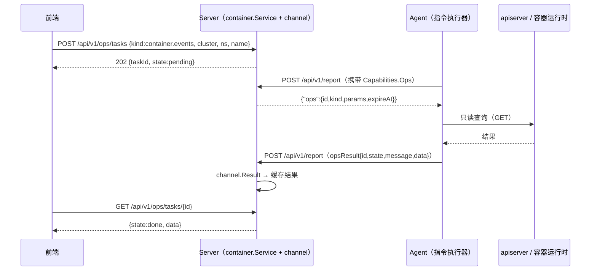

# 容器与可观测模块详细设计

日期：2026-09-30
上位文档：`2026-09-30-ops-platform-evolution-design.md`（总体设计）、`2026-09-30-ops-platform-capability-map.md`（全景对照表 §3.8、§3.9、§3.10）
决策记录：`docs/adr/0002-log-backend-abstraction.md`、`docs/adr/0003-container-management-downlink.md`

## 意图与边界

**意图**（两条线）：

1. **容器/K8s**：把"只有指标"的容器监控，升级为**可查看、可排障**的只读管理面（工作负载、事件、日志、描述信息），并为将来受控的写操作（exec、下发）留出通道。
2. **日志与可观测**：把"能采能搜"的集中日志，升级为**结构化、可字段检索、后端可替换**的日志能力；明确链路追踪的取舍。

**边界**：

- **不集成重量级平台**：不引入 Rancher（25942★，需独立集群）/ KubeSphere（17059★，NOASSERTION 许可）；理由是它们与"内网离线 + 轻量单二进制"定位冲突（调研报告 §2.2、§4.2）。
- **默认只读**：首批只做读取类操作；`exec` 等写操作后置 P2 且需显式开启。
- **不引入 AGPL/重量级日志后端**：默认沿用自研落盘；仅抽出接口，第二个适配器随需引入（ADR-0002）。
- **不做链路追踪**（P3，见 §链路追踪取舍）。

## 现状与依据

| 事实 | 依据 |
|---|---|
| **K8s 凭据只存 Agent 本地，不上报** | `internal/model/metric.go:543-553` `K8sInstanceConfig{Name, APIServer, Kubeconfig, Token, InsecureTLS, MetricsServer, ExporterURL}`，注释：「Kubeconfig/Token 等凭据仅存 Agent 本地，不上报 Server（K8sInstance 结构本身不含凭据字段）」；`K8sInstance:556-561` 仅含 `Instance(=apiserver 地址)/Name/Node/Group/Version` |
| K8s 采集是**只读 GET** | `internal/agent/collector/k8s.go:collectPods/collectWorkloads` |
| Docker 采集经 Engine API | `internal/agent/collector/docker.go`（`/var/run/docker.sock`） |
| **Server 侧无 K8s 管理接口** | 全仓无 `*k8s*` handler；仅指标读取 `GET /api/v1/middleware/k8s/instances` |
| 下行指令先例（协议/协商/回执/过期俱全） | `internal/server/receiver/receiver.go:HandleReport`（`resp["command"]="upgrade"`、`resp["defense"]=cmd`，仅当 `payload.Capabilities.Defense` 才下发）；`internal/agent/reporter/reporter.go:ReportResponse{Status, Command, Defense}`；`payload.DefenseResult` → `defense.UpdateResult`；`internal/server/security.DefenseStore` 的 `Take/ExpireOverdue` |
| 日志检索现有语义 | `internal/server/logstore/query.go:Store.Query`；`internal/model/log.go:69-93` `LogQuery{From, To, Keyword, Regex, Nodes[], Sources[], Limit}`、`LogQueryResult{Lines, Truncated, Cursor, ScannedBytes, ScannedLines, Files}`；预算常量 `DefaultScanBudgetBytes=64MiB`、`DefaultScanBudgetLines=200000`、`DefaultLimit=200/MaxLimit=1000`；游标 `Cursor{File,Offset}`（文件内绝对字节偏移） |
| 日志采集已有（含多行合并） | `internal/agent/logship/ship.go:Shipper.send`、`internal/agent/collector/logcollect.go:mergeMultiline` |
| 日志指标已可用于告警 | `model.LogPatternNamePattern` 注释说明模式名拼进指标 `<来源>_log_<模式>_total`；规则类型 `RuleTypeThreshold`（`internal/model/metric.go:649-661`） |
| **链路追踪完全无实现** | 全仓 `trace/span/otel/jaeger/skywalking` 0 命中 |
| 官方 Dashboard 已归档、国产面板停维护/不可访问 | 调研报告 §2.2：`kubernetes-retired/dashboard` ARCHIVED、`KubeOperator` ARCHIVED、`eipwork/kuboard(-v3)` 404 |

## 容器只读管理面设计

### 3.1 数据通路（为什么是"异步任务"而不是"同步代理"）



**关键取舍（必须写清，避免体验预期错位）**：指令是**随 Agent 上报响应下发**的，单次往返至少一个上报周期（默认 15s）。因此接口语义是**异步任务**（提交 → 任务 ID → 轮询/WS 推送），**不是**"点开即返回"的同步代理。

**被拒的两个替代方案**：

| 方案 | 拒绝理由 |
|---|---|
| Server 直连 apiserver | 需要把 Kubeconfig/Token 上报到 Server，**直接破坏** `K8sInstanceConfig` 注释所声明并已被遵守的凭据边界 |
| Server↔Agent 新建长连接 | 新增协议、鉴权与穿透复杂度；网闸（edge/hub）场景下更复杂；而既有"响应内下发"链路已被两条业务验证可用 |

### 3.2 指令类型（kind）

| kind | 语义 | 首批 | 说明 |
|---|---|---|---|
| `container.workloads` | 列集群/命名空间下的工作负载（Deployment/StatefulSet/DaemonSet/Job）与副本状态 | ✅ | 复用 `k8s.go:collectWorkloads` 的只读 GET |
| `container.pods` | 列 Pod（含重启次数、状态、所在节点） | ✅ | 复用 `collectPods` |
| `container.describe` | 单对象详情（含 YAML/描述信息，凭据相关字段**必须脱敏**） | ✅ | 需定义脱敏字段清单 |
| `container.events` | 命名空间/对象的事件列表（按时间倒序、分页） | ✅ | 事件量大，必须有上限与缓存 |
| `container.logs` | 拉取 Pod/容器日志（tail 行数、since、上一实例） | ✅ | 与集中日志的边界见 §4.4 |
| `container.exec` | 交互式终端 | ❌（P2） | 需显式开启 + 独立权限点 + 审计 + 会话时长限制 |

### 3.3 安全边界（四道护栏）

沿用既有"本机护栏 → 能力协商 → 中心授权 + 审计"思想，落地为四道（与总体设计 §下行操作通道 一致）：

1. **本机护栏**：`agent.yaml` 开关（如 `guards.ops.containerLogs`、`guards.ops.exec`），默认只开只读类。
2. **能力协商**：仅当 Agent 上报 `Capabilities.Ops` 含该 kind 才下发（对齐 `Capabilities.Defense` 现做法）；不支持的节点在前端显示"需升级 Agent/未开启"。
3. **中心授权 + 审计**：权限点 `container:read` / `container:exec`；`container:exec` 纳入高风险语义；任务提交与结果均写审计。
4. **默认只读 + 过期作废**：复用 `Take/ExpireOverdue` 语义，未领取/超时任务自动作废，避免堆积。

**脱敏规则**：`container.describe` 返回的 YAML 中，`Secret`、`ServiceAccount` token、`dockerconfigjson` 等敏感字段一律以占位符替换；日志拉取不返回环境变量全文。

### 3.4 前端信息架构（借 headlamp，不抄代码）

参考 `kubernetes-sigs/headlamp`（7352★，Apache-2.0）的信息组织：**集群 → 命名空间 → 资源类型 → 对象 → （详情/事件/日志/终端）**；其 README 明确「UI controls reflecting user roles (no deletion/update if not allowed)」——与现有 RBAC + 资源范围理念一致，因此**前端按权限隐藏操作按钮**，服务端仍为安全边界。

新增 `web/src/components/container/`：`K8sClusterView.vue`、`WorkloadListView.vue`、`WorkloadDetailDrawer.vue`、`EventListView.vue`、`ContainerLogViewer.vue`。复用既有抽屉/表格/`RefreshBar` 约定；**不新建独立前端框架**。

## 日志聚合设计

### 4.1 采集侧增强（Agent）

| 能力 | 现状 | 本次增强 |
|---|---|---|
| 采集（来源 + 路径 + patterns） | 已实现 | 不变 |
| 多行合并 | 已实现（`logcollect.go:mergeMultiline`） | 不变 |
| **结构化解析** | 无 | 按来源声明 `format: json \| regex`（regex 支持命名捕获）→ 产出字段 map |
| **标签注入** | 无 | 注入 `node`（已有）、`source`（已有）、容器场景追加 `namespace/pod/container/workload` |
| 限速 / 每日上限 / 偏移落盘 | 已实现 | 不变 |

**解析失败不丢数据**：解析失败时**保留原始行**并标记 `parseFailed=true`，只跳过字段化——避免"因为格式变了就看不见日志"。

### 4.2 模型扩展（明确标注为新增，不臆造既有字段）

- `model.LogQuery`（`internal/model/log.go:70-78`）新增可选 `Fields map[string]string`（字段等值过滤）。
- `model.LogHit` 新增可选 `Fields map[string]string`（解析结果）。
- `model.LogQueryResult` **不新增字段**（`Truncated/Cursor/ScannedBytes/ScannedLines/Files` 语义已完整，且是"为什么没结果"的诊断依据，必须原样保留并回传）。

### 4.3 存储抽象（`LogStore`）与第二适配器

- 接口沿用既有方法名与既有模型类型（**不得改名**，接口是调用方与测试的共同接缝）：

```
// LogStore 是日志存储抽象；现有分片落盘实现作为默认适配器，外部后端作为可选适配器。
type LogStore interface {
	Write(entries []model.LogEntry) (dropped int, reason string, err error)
	Query(q model.LogQuery, cursor logstore.Cursor) (model.LogQueryResult, error)
	Backend() string
}
```

- **随第二适配器一起引入**（ADR-0002）：目前只有一个适配器，提前抽象是假想接缝。首选候选 **VictoriaLogs**（2331★，Apache-2.0，单二进制，与现用 VictoriaMetrics 同厂；官方称相比 Elasticsearch/Loki 最多省 30x 内存、15x 磁盘——调研报告 §2.3）。
- **保留的检索语义**（不得改动）：游标不透明（前端原样回传）、`Truncated` 必须回传（静默截断会让人以为"日志就这么多"）、扫描预算与三项诊断。

### 4.4 与集中日志既有能力的边界

| 场景 | 走哪条 | 理由 |
|---|---|---|
| 已采集上行的历史日志检索 | **集中日志**（`GET /api/v1/logs`） | 有索引化扫描预算与游标语义，按天保留 |
| 某 Pod 的实时/即时日志（未配置采集） | **`container.logs` 指令** | 按需拉取，不进 Server 存储，避免"任意 Pod 日志全量落盘"的容量与合规风险 |
| 需要长期保留的容器日志 | 引导用户**配置 `logSources`** | 让"要不要留"由采集配置显式决定 |

### 4.5 由日志创建告警规则

在检索页支持"用当前查询条件创建规则"：底层**复用既有日志指标** `<来源>_log_<模式>_total` 与 `RuleTypeThreshold`，**不新增规则类型**、不改告警引擎。这等价于把 README 路线图「日志分析增强（P1）」中"在检索页直接由日志内容创建规则"落地为"由检索条件生成阈值规则"，避免引擎侧扩张。

### 4.6 Pod 日志进检索的协议（2026-10-06 落地，替代 §4.1 的采集侧标签注入）

§4.1 当初设想"容器场景在采集侧注入 namespace/pod/container 标签"。实施时改为**从文件路径解析身份**，
理由与最终协议如下（与 §4.1 的偏离在"实施记录 · 批次 3"中说明）：

- **身份来源**：kubelet 的容器日志目录布局 `<PodLogDir><namespace>_<pod>_<uid>/<container>/<序号>.log`。
  采集侧解析路径即得身份，**不必读 K8s API**——"这个文件在我读的这台机器上"本身就是最权威的事实，
  也不需要 Agent 持有集群凭据（与只读管理面走 kubeconfig 是两条独立路径）。
- **开关与校验**：`logSources[].podLogs: true` 显式声明（默认 false）；开启时**启动期校验** paths 落在
  `/var/log/pods/` 下。不猜：解析出的身份会决定日志被标到哪个资产上，猜错就是"在别人的资产下看到自己的日志"。
- **协议**：身份**按批次携带**（`model.LogBatch.Origin`）——采集器逐文件上行（一批 = 一个文件），
  同一文件的行必然同属一个容器，逐行重复既费流量又给"同批出现两个身份"留口子。
  **只上报解析出的身份，不上报路径**（路径会暴露被监控机的目录结构，而检索与联动只需要"属于哪个 Pod"）。
- **行格式（CRI 框架）**：kubelet 写下的容器日志行不是应用那一行本身，而是
  `<RFC3339Nano 时间> <stdout|stderr> <F|P> <应用正文>`。采集侧**剥掉这层框架**再上行：时间取框架里的
  **行内时间**，正文取框架之后的部分，模式匹配也作用在正文上（框架是运行时的，不是应用写的日志）。
  两个后果都必须处理：不取行内时间就只能用采集时刻，于是同一轮采集的所有行挤在同一个毫秒上
  （2026-10-07 实机验证时正是如此：一轮 5 行只有 1 个时间戳），时间范围过滤与排序一并退化；
  不剥框架则正文每行都带"时间 + stdout F"噪声，字段解析也会把它算进去。
  **只对 `podLogs` 来源做这一步**——普通文件里"恰好长这样"的行不该被改写。
  时间戳是 9 位纳秒带偏移（`2026-10-06T21:52:54.944292439+08:00`），按 `RFC3339Nano` 解析。
- **校验**：`model.NormalizeLogOrigin` 由采集侧与服务端**共用**（与来源名/字段名同一取向）；
  只给一半身份视为非法（定位不到资产可接受，**定位错**不可接受）；非法身份回 400 而不是"丢掉身份照收"。
- **落库与检索**：本地后端随行写进同一条 JSON；VictoriaLogs 写成 `k8s_namespace` / `k8s_pod` /
  `k8s_container` 三个字段并**列入保留字段**（正文不得覆盖身份，否则一条日志就能伪造归属），
  同时不进字段目录（它们是协议字段，不该混进界面的字段筛选候选）。检索侧新增 `pods=<命名空间>|<Pod>`
  过滤——身份是独立维度，不让它走 `field=` 通道（那等于把"哪些名字是身份"交给用户去记）。
- **联动**：响应新增 `podAssets`（键 `<命名空间>|<Pod>`），按「节点 + 命名空间 + Pod 名」反查容器资产。
  不用自然键：Pod 自然键含**集群**，而容器日志路径里没有集群标识。

**采集侧的两个取舍**（都是"噪声 vs 漏报"的权衡）：

- 通配符**零匹配不算失败**（`up` 保持 1）：Pod 是短命的，此刻没有匹配文件是正常状态；
  记成离线会让"日志采集不可用"在每次缩容时误报，最后没人再看这个信号。配置写错由启动期校验兜住。
- **只对 pod 来源清理已消失文件的偏移**：容器日志路径带 Pod UID，文件被 kubelet 回收后永不再出现，
  留着偏移会让偏移文件无界增长（而它每轮都要整体重写）；普通文件路径可能轮转后重建，删偏移会让它
  被当成新文件"从末尾开始"、静默跳过开头内容——那是丢日志。
- **CRI 框架剥离同样只对 pod 来源**：框架是 kubelet 加的，普通文件里"恰好长这样"的行不该被改写。
  配套一条运维事实：**已入库的行不会被重写**，所以升级后核对要按"Agent 换装时刻"划界——换装前的行
  仍带框架、且同轮共用一个时间戳（历史数据的形态），换装后的行才干净。反过来说，"升级后仍看到带框架的行"
  本身不能判定为修复失败，要先看它的时间戳落在界线的哪一侧。

## 链路追踪取舍（明确结论）

**结论：本批不做（P3）**。

- 理由：链路追踪需要**应用侧侵入**（各语言 SDK/探针；即便 Java 可 `-javaagent` 也需运维介入），与"内网离线 + 轻量单二进制 + 不改客户应用"的定位冲突。
- 备选路线（按侵入度排序，供未来决策）：
  1. **eBPF 零侵入**：如 `deepflowio/deepflow`（4286★，Apache-2.0，官方定位 "eBPF Observability - Distributed Tracing and Profiling"），代价是内核版本要求与部署复杂度；
  2. **OTel 网关**：应用侧接入 OTel SDK/Collector，Server 侧只做接收与展示；需客户应用配合改造；
  3. **APM 自成体系**：`apache/skywalking`（24967★，Apache-2.0）——功能强但需应用探针与独立 JVM 组件，与本定位冲突最大。
- **前置条件**（写入本设计的门槛）：明确要追踪的协议与语言矩阵、可接受的应用侧改造范围、存储与保留预算。

## 接口草案与权限点

```
# 容器管理面（新增；注意既有中间件指标路由 /api/v1/middleware/k8s/instances 保持不动）
GET    /api/v1/container/k8s/clusters                 # 集群清单（来自 K8sInstance，无凭据）
POST   /api/v1/ops/tasks                              # 提交任务 {kind, cluster, namespace, name, params}
GET    /api/v1/ops/tasks/{id}                         # 查询任务状态与结果（轮询；或经 /ws 推送）
DELETE /api/v1/ops/tasks/{id}                         # 取消/清理

# 日志（扩展现有路由，不新建）
GET    /api/v1/logs?from=&to=&q=&regex=&nodes=&sources=&fields=key:value&limit=&cursor=
```

**权限点**：`container:read`（集群/工作负载/事件/日志）、`container:exec`（P2，高风险）；日志沿用既有 `logs` 前缀。
**审计**：任务提交、结果、被拒（`RecordPermissionDenied`）均落审计；`container:exec` 记录会话起止与长度。

## 前端与菜单

- 新增 `web/src/components/container/`（见 §3.4）。
- `web/src/components/LogsView.vue` 增强：字段过滤条、命中行展开（字段 + 上下文行）、"由本次查询创建规则"入口。
- 菜单挂载遵循现有 `Sidebar` 分组方式；**不新增一级菜单**，容器归入「中间件/容器」，资产归入「资产」（与 D2 的 `asset/` 一致）。

## 文档与验证

- 术语新增并写入 `CONTEXT.md`：`工作负载`、`下行操作（Ops 指令）`、`高危操作护栏`、`日志后端`、`结构化解析`、`字段检索`（含 `_避免_` 同义词）。
- 实现阶段测试面（本设计不写代码）：
  - `channel`：能力协商（不支持的 kind 不下发）、过期作废、结果回执幂等；
  - `container.Service`：脱敏（Secret/token 字段被替换）、事件分页上限、`container.logs` 不落 Server 存储；
  - 日志：解析失败保留原始行、`Fields` 过滤与既有 `Keyword/Regex` 叠加语义、游标与 `Truncated` 行为不变（回归既有测试）；
  - 安全：无 `container:read` 权限返回 403 并落审计；未开启本机护栏时任务不被领取。
- 验证命令（沿用仓库约定）：`go test ./...`、`go vet ./...`、`npm --prefix web test`、`npm --prefix web run build`。

## 风险与取舍

| 风险 | 取舍 |
|---|---|
| 交互延迟（≥1 个上报周期，默认 15s） | 显式定义为**异步任务**；提交后立即返回任务 ID，前端轮询/WS 推送；对"快速排障"场景通过缓存上次结果缓解 |
| 事件/日志拉取量不可控 | 强制 `limit` 与时间窗上限；结果只缓存最近 N 条与 TTL；不进 Server 日志存储 |
| 凭据边界被削弱 | 明确禁止 Server 直连 apiserver；`container.describe` 强制脱敏；Agent 侧护栏默认只开只读 |
| 结构化解析带来 CPU 开销 | 解析在 Agent 侧按来源声明开启（默认关闭 JSON/正则解析），并纳入既有采集周期预算 |
| 抽 `LogStore` 抽象引入打包复杂度 | 接口与第二适配器一起落地；默认不引入外部后端（ADR-0002） |
| `exec` 被当作"顺手功能"提前做 | 明确 P2 + 独立高危权限点 + 显式开启 + 审计，进入路线图而非首批 |
| 与集中日志职责混淆 | 用 §4.4 的边界表固化：历史检索 vs 按需拉取 vs 长期保留三条路径 |

## 实施记录（按批次追加）

### 批次 1（2026-10-02）：容器只读管理面

ADR-0003 那条通路上的第一批只读能力：集群清单 + 工作负载 + Pod + 事件 + 对象详情。

| 层 | 改动 |
|---|---|
| 协议 | `internal/model/ops.go`：4 个 kind 常量 + 集群/命名空间/对象名/资源类型四个白名单正则；`OpsResult` 新增可选 `JSON`（结构化载荷，与 `Data` 的分节文本并存、不互相替代）；新增 `ContainerQueryResult`（列名 + 行的通用表格形态；放 model 是因为它**是协议载荷**） |
| Server | `internal/server/ops/catalog.go` 新增「容器」分组 4 个**只读**动作（参数规格即校验）；`internal/server/api/container_api.go` 提供 `GET /api/v1/container/k8s/clusters`；权限点 `container:read` 并入内置「全局运维管理员」，与 `middleware:read` 刻意分开 |
| Agent | 护栏新增 `guards.ops.container`（三态 `*bool`，默认放行）；`internal/agent/collector/k8s_query.go` 复用既有 `buildK8sConn` / `getJSON` 实现只读查询；`internal/agent/ops/container.go` 负责护栏 + **参数本地复校** + 分派；`cmd/agent/main.go` 仅在配了 `k8sInstances` 时注入 |
| 前端 | `web/src/components/container/ContainerView.vue`（集群选择 / 三个 Tab / 提交-轮询 / 详情抽屉）；路由 `/container`（`perm: container:read`）；侧栏「观测监控」与命令面板入口 |

**关键取舍（都写进了代码注释）**：

1. **不做原始 YAML**：`container.describe` 是白名单投影。把对象 JSON 脱敏后原样透出，只要漏一个字段就是一次凭据泄露——Pod 的 `env[].value`、ConfigMap 的 `data`、注解里的 `last-applied-configuration` 都可能含明文。`secrets` 因此不在可选资源类型里（要看 Secret 请直接上 `kubectl`）。
2. **行数有界**：所有列表都用 apiserver 的 `limit` + 自己的行上限（工作负载 300 / Pod 500 / 事件 200），超出即 `truncated` 并显式回传。绝不"先全拉回来再截断"。
3. **能力随实现就位**：没配集群的机器 `coll.K8s()` 返回 nil → 不声明容器能力 → 中心不下发。**宁可让界面显示"该节点不支持"，也不要下发一条注定失败的任务**。
4. **容器单独一个本机开关**：它读的是整个集群结构而不是本机；"愿意交出自己的负载"和"愿意交出集群结构"是两件事，所以各有一个开关。
5. **撤回语义照旧诚实**：只有 `queued` 能撤回，已领取的如实说"无法撤回"。

**本批未做（仍在路线图）**：`container.logs`（Pod 日志拉取——用户 2026-09-30 明确说"后面再考虑"）、`container.exec`（P2，需独立高危权限点与显式开启）、§4 的日志结构化解析与字段检索、`LogStore` 后端抽象（ADR-0002，随第二适配器一起做）。

**验证**：`go test ./...` 全绿；`npm --prefix web run build` 与 `npm --prefix web test`（38 例）通过。新增用例：动作目录与参数注入（`internal/server/ops/catalog_test.go`）、集群清单的权限 / 资源范围 / 凭据字段边界（`internal/server/api/container_api_test.go`）、护栏三态与「参数不合法时一次都不调用查询实现」（`internal/agent/ops/container_test.go`）。
**尚未在 dev-server 做实机端到端验证**（需一台配了 `k8sInstances` 的节点）。

### 批次 2（2026-10-06）：`LogStore` 后端抽象与 VictoriaLogs 适配器（§4.3，ADR-0002）

ADR-0002 的"接口与第二适配器同时落地"：本批把日志存储抽成接口，并给出第一个外部后端实现。**默认后端不变**（自研分片落盘），外部后端是可选能力。

| 层 | 改动 |
|---|---|
| 接口 | `internal/server/logstore/backend.go`：`LogStore`（`Append` / `Query` / `Backend` / `Sources` / `FieldNames`）+ 后端标识 + 工厂 `NewBackend` + 游标跨后端校验 |
| 适配器 | `internal/server/logstore/victorialogs.go`：写入 `/insert/jsonline`（NDJSON + `_stream_fields=node,source`）、检索 `/select/logsql/query`（LogsQL 翻译 + JSON Lines 解析）、元数据 `field_names` / `stream_field_values` |
| 配置 | `logBackend: local|victorialogs`、`logVictoriaLogs.{addr,queryTimeout,writeTimeout}`；**后端名写错即启动失败**（静默降级会把配置笔误变成"日志功能消失了"） |
| 装配 | `cmd/server`：工厂选后端，receiver 与 api 共用同一个后端实例；retention 只对自研落盘生效，外部接管时显式声明 |
| 错误分类 | `logstore.ErrBackendUnavailable`：接口层回 **502**（"日志后端挂了"）而不是 400（"查询写错了"）；Agent 上行同理 |
| 前端 | 保留策略页在外部后端下显示"由外部后端负责"而不是"0 个文件" |

**关键取舍**：接口签名按**实际调用面**修正（`Append(model.LogBatch)` 而非初稿的 `Write([]model.LogEntry)`，见 ADR-0002 落地记录）；游标加后端标识（跨后端重放会静默跳行）；检索语义逐条对齐（子串→正则过滤器、精确等值→`field:="v"`、闭区间→`end+1ms`、字段读取时从正文重新提取）；不实现"能力对齐"的假象——外部后端没有逐文件扫描诊断，就如实返回 0 并由界面区分。

**验证**：契约用例同一套断言跑两个适配器（`backend_contract_test.go`，第二个跑在按文档实现文档化子集的假后端上）+ 方言/参数级单测（`victorialogs_test.go`）。**未在真实 VictoriaLogs 实例上联调**，清单见 `../../testing/2026-10-06-platform-review-delta.md` §十。

### 批次 3（2026-10-06）：Pod 日志进集中日志检索（§3.8 的另一半，§4.6）

全景表 §3.8 此前标注"Pod 日志进检索需 Agent 协议扩展，属独立立项"。本批做完了这条链路，且**不改 Agent 与 Server 的接口形态**（只是给批次加了一个可选字段）。

| 层 | 改动 |
|---|---|
| 配置 | `logSources[].podLogs: true`（默认 false）+ 启动期校验 paths 落在 `/var/log/pods/` 下 |
| 采集 | paths 支持通配符（`/var/log/pods/*/*/*.log`）：单轮文件数上限 200 且**截断可见**；零匹配不算失败；pod 来源清理已消失文件的偏移 |
| 协议 | 批次级 `model.LogBatch.Origin{namespace,pod,container}`；只上报身份、不上报路径；`model.NormalizeLogOrigin` 双端同规则校验 |
| 落库 | 本地后端随行写同一条 JSON；VL 写 `k8s_namespace`/`k8s_pod`/`k8s_container` 并列入**保留字段**（正文不得覆盖身份） |
| 检索 | `pods=<命名空间>|<Pod>` 过滤（两个后端语义一致）；命中行带 `origin` |
| 联动 | 响应新增 `podAssets`（键 `<命名空间>|<Pod>`）；`Store.assetsByPodIdentity` 按「节点 + 命名空间 + Pod 名」反查，**类型必须是 pod**（同名主机资产不能被当成 Pod） |
| 前端 | 日志行展示「命名空间/Pod · 容器」并标到 Pod 资产；「只看」按容器身份收窄（含节点+来源收窄）；生效中的容器条件可删 |

**关键取舍**（与 §4.1 原稿的偏离）：① **身份从文件路径解析，而不是读 K8s API 或按容器 ID 反查**——采集侧读的就是那台机器上的文件，"文件属于哪个 Pod"是本地事实，不需要集群凭据，也不引入 API 往返与缓存失效问题；② **结构化解析放在 Server 侧**（`logparse`）而不是按 §4.1 设想的 `format: json|regex` 配置——放 Server 侧意味着存量 Agent **无需升级**；③ 身份是**协议字段**而不是业务字段：独立过滤参数 + 保留字段保护 + 不进字段目录；④ 通配符零匹配与偏移清理两条都按"Pod 短命"这一事实取舍（见 §4.6）。

**验证**：契约用例（身份落得住读得回、正文伪造身份无效、非法身份两个后端都拒、容器过滤「或」与无身份行不命中）+ 路径解析 14 组 + 采集行为（每文件各带身份、文件数上限、偏移清理与非 pod 不清理、零匹配 up=1）+ 资产反查 7 组 + 接口 `podAssets`/`pods` 参数 + 前端 3 组。**未在真实 k3s 集群上端到端验证**（dev-server 的 Agent 未开 `podLogs`），边界见 `../../testing/2026-10-06-platform-review-delta.md` §十二。
