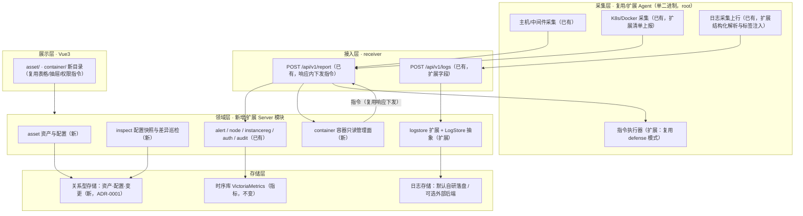

# 一体化运维平台总体设计（在现有监控平台上演进）

日期：2026-09-30
范围依据：`2026-09-30-ops-platform-capability-map.md`（功能全景与实现状态对照表，本次评审卡点）
配套详设：`2026-09-30-asset-cmdb-design.md`（资产与配置）、`2026-09-30-container-observability-design.md`（容器与可观测）
决策记录：`docs/adr/0001-cmdb-relational-store.md`、`docs/adr/0002-log-backend-abstraction.md`、`docs/adr/0003-container-management-downlink.md`

## 意图与边界

**意图**：在现有 nebula-monitor（Go Server + 自研 Agent + VictoriaMetrics + 告警引擎 + RBAC/离线包）之上补齐「模型、关系、变更、操作面、索引」五类能力，使其从**监控平台**演进为**一体化运维平台**。首批两条主线（已确认）：

1. **资产与配置**：资产台账、自动发现与关系拓扑、变更历史、配置快照与差异巡检
2. **容器与可观测**：K8s/容器只读管理面、容器排障、日志结构化与检索、日志后端可替换

**边界**（不做的事，避免范围蔓延）：

- **不新起仓库、不换技术栈**：沿用 Go 单二进制 Server/Agent + systemd、Vue3 + Vite、VictoriaMetrics、离线 full/upgrade 双包。
- **不改动现有语义**：告警 firing/Ack 两套状态机、三层静默/抑制/分组/收敛、资源范围服务端强校验、审计类别与动作、指标保留期归属时序库——本次只**扩展**（新增权限点、新增范围维度），不重定义。
- **不引入需外网或重量级依赖**：默认只借开源**设计思想**；代码级复用仅限 Apache-2.0/MIT 集合（依据见调研报告 §三 许可合规）。
- **非目标（明确推迟）**：链路追踪（P3，需应用侧侵入，路线见 §风险与取舍）、堡垒机/PAM 会话代理（P3）、工单/审批引擎（P2）、应用发布流水线（P3）、移动端与 i18n（P3）。

## 现状与依据

### 2.1 采集侧：能力已存在，缺"模型化"

- 主机/硬件/分区/进程：`internal/agent/collector/hostinfo.go`
- 容器/K8s 指标：`internal/agent/collector/k8s.go:collectPods/collectWorkloads`（只读 GET apiserver）、`internal/agent/collector/docker.go`
- 日志采集与上行：`internal/agent/collector/logcollect.go:mergeMultiline`、`internal/agent/logship/ship.go:Shipper.send`（`POST /api/v1/logs`）
- 安全检测（SSH/sudo/FIM/基线）：`internal/agent/collector/security.go`
- 结论：**资产信息其实已经在采集**，缺的是资产模型、关系、变更历史与生命周期（见对照表 §3.2）。

### 2.2 存储侧：三层已成型，缺"关系型"

- 指标：`internal/server/storage/vm.go:Storage` 接口（`Write / QueryRange / QueryLatest / QueryInstant / QueryInstantWithLookback / QueryAllLatest / Backend`），默认 VictoriaMetrics，可切 Prometheus/Mimir/Cortex/Thanos。
- 日志：`internal/server/logstore/query.go:Store.Query` + `internal/server/receiver/logs.go:HandleLogs`；游标 `Cursor{File,Offset}`（文件内绝对字节偏移），扫描预算 `DefaultScanBudgetBytes`（64MiB）、`DefaultScanBudgetLines`（200000），返回 `Truncated` + 续读游标。**无全文索引、无字段解析**。
- 本地状态：JSON 文件落盘（告警处置 `alert_acks.json`、保留策略 `retentionFile`、安全事件 `security_store.json`、看板 `dashboards.yaml` 等），审计/安全事件按内置上限淘汰。
- 结论：**"Server 完全无状态"只指指标数据归时序库**；本地持久化早已存在，因此为资产引入关系型存储是**同层演进**，不是定位改变（ADR-0001）。

### 2.3 下行通道：已有先例，可直接复用（关键依据）

现有两条 Server→Agent 指令链路，**协议、协商、回执、过期一应俱全**：

| 环节 | 证据 |
|---|---|
| 响应载体 | `internal/server/receiver/receiver.go:HandleReport`（`resp := map[string]interface{}{"status":"ok"}`，随后注入 `resp["command"]="upgrade"`、`resp["defense"]=cmd`） |
| Agent 侧结构 | `internal/agent/reporter/reporter.go:ReportResponse{Status, Command, Defense *model.DefenseCommand}`（注释明确"旧 Agent 不消费、旧 Server 不返回，双向兼容"） |
| 能力协商 | `receiver.go`：仅当 `payload.Capabilities.Defense` 为真才下发（`defense.SaveCap`） |
| 指令队列 | `internal/server/security.DefenseStore`：`Take(node)`（领取）、`ExpireOverdue()`（超时作废） |
| 执行回执 | `payload.DefenseResult{CommandID, State, Message}` → `defense.UpdateResult(...)` |
| 执行侧 | `internal/agent/defense/executor.go:Executor.Execute` |
| 升级另路 | `internal/server/node/manager.go:ConsumeUpgrade` + `internal/agent/upgrader/upgrader.go:Run` |

**结论**：容器管理面的下行操作**必须复刻这一模式**（结构化指令 + 能力协商 + 回执 + 过期），而不是新建长连接/新协议。原因不是"省事"，而是：凭据（kubeconfig/token）**只存 Agent 本地、不上报**（`internal/model/metric.go` 的 `K8sInstanceConfig` 注释），Server **无法直连 apiserver**，操作只能由 Agent 执行。

### 2.4 权限与审计：机制完备，需扩展维度

- 包装器与范围校验：`internal/server/api/auth.go:permit / permitNode / permitHostname / authz / checkPerm / checkNodeScope / checkNodeTarget / denyScope / RecordPermissionDenied`
- 范围过滤：`internal/server/auth/policy.go:FilterGroups / FilterByGroup / CheckBatchGroups`、`Principal.CanAccessGroup`
- 权限点目录：`internal/server/auth/model.go:PermissionCatalog()`；现有前缀域：`dashboard / nodes / groups / alerts / notify / silence / probe / report / metrics / middleware / security / agent / system / audit / users / roles / logs`
- 高风险标记：`internal/server/auth/policy.go:HighRiskPermissions`
- 审计：`internal/server/api/audit.go:AuditMiddleware`（只记管理写请求）+ `RecordLoginAudit / RecordChangeAudit / RecordPermissionDenied`

### 2.5 前端与交付形态

- 页面：顶层 `web/src/components/{LoginView,OverviewView,HostsView,NodeView,MiddlewareView,AlertsView,DialTestView,ReportView,UpgradeView,NotifyView,SecurityView,LogsView,AuditView,StatusView}.vue`；子目录按类型（`k8s/ docker/ mysql/ redis/ … screen/ dashboard/ rbac/ settings/`）。**无 `asset/`、无 `container/`**。
- 路由注册：`internal/server/api/query.go:RegisterRoutes`（约 140 条 `/api/v1/*`），另有 `cmd/server/main.go` 注册 `POST /api/v1/report|logs`、`api/ws.go:RegisterWS`、`agentdist/agentdist.go:Distributor.Register`。
- 离线交付：`build/fetch-packages.sh`（离线依赖缓存）+ `build/release.sh`（full + upgrade 双包）+ `deploy/install-server.sh|agent-install.sh|install-tsdb.sh`。

### 2.6 已发现的文档滞后项（必须一并修订）

**采集项模板（Collector Template）与取数护栏（templateGuards）已被移除**：

- 移除提交：`1e25239 refactor!: 移除采集项模板功能全链路`
- 代码事实：`internal/template` 目录不存在；`internal/server/api/query.go` 无 `middleware/templates` 注册
- 文档滞后：`CONTEXT.md` 仍有 **7 处**按现役术语描述；`docs/c1-collector-templates.md`、`docs/refactor-plan.md`、`docs/permission-matrix.md` 亦按已交付描述

处置：在本计划的「术语与路线图同步」步骤中修订，**不得**在新设计中继续引用该功能为现有能力。

## 目标架构与模块划分



### 3.1 新增模块与职责边界（深模块：小接口 + 厚实现）

| 模块（包） | 对外接口（小） | 藏在内部的复杂度 | 依赖方向 |
|---|---|---|---|
| `internal/server/asset` | `Service`：`Upsert(发现来源) / Get / List(query) / Link / Unlink / Snapshot / Diff / History` | 类型系统与属性校验、采集值与人工值合并、关系一致性、变更 diff 与留痕、审计写入、范围裁剪 | ← 依赖 `store`（关系库）、`auth`（范围）、`audit` |
| `internal/server/inspect` | `Service`：`Run(scope) / Report(id) / ListRuns` | 快照采集编排、合规模板比对、差异分级、结果留存 | ← 依赖 `asset`、`security`（基线复用） |
| `internal/server/container` | `Service`：`List / Describe / Events / Logs`（读）；`Exec`（写，受护栏，P2） | 指令构造与下发、结果组装、超时与过期、结果缓存、权限与审计 | ← 依赖 `channel`、`asset`（可选绑定）、`auth/audit` |
| `internal/server/channel` | `Dispatch(node, cmd) / Pending(node) / Result(node, res)` | 队列与过期、能力协商、幂等与重试语义、审计 | ← 被 `container`（及未来作业模块）复用；由 `receiver` 消费 |
| `internal/server/logstore`（扩展） | 抽出 `LogStore` 接口：`Write`、`Query(model.LogQuery, Cursor)`、`Backend()` | 分片落盘、扫描预算、游标语义、上限与丢弃原因 | 现有 `Store` 作为默认适配器；外部后端为新适配器 |

**设计要点（seam 纪律）**：

- `LogStore` 的接口**必须沿用现有方法名 `Query`** 与既有参数/返回类型（`internal/server/logstore/query.go:Store.Query`、`model.LogQuery`），不得另造 `Retrieve(...)` 之类签名——接口就是调用方与测试共同的接缝，改名会造成两套语义。
- 目前日志只有**一个**适配器（自研落盘），按"一个适配器只是假想接缝"的纪律，`LogStore` 接口**随第二个适配器（VictoriaLogs）一起引入**，不提前抽象（ADR-0002）。
- `channel` 是把既有"响应内下发指令"模式**收敛成模块**（当前 `upgrade` 与 `defense` 各写一套）：这是典型的 deepening——把队列、过期、能力协商、回执归拢到一处，`container` 与未来的批量作业都复用，符合 deletion test（删掉它，复杂度会在多个调用方重现）。
- 资产范围（业务/资产分组）与节点分组范围**并存**：`asset` 内部把"资产 → 所属节点"映射到既有节点分组，范围校验仍走 `api/auth.go` 的包装器，**服务端强校验，绝不退化为前端隐藏**。

### 3.2 存储分层结论

| 数据 | 存储 | 本次动作 |
|---|---|---|
| 指标 | VictoriaMetrics（`storage.Storage`） | 不变 |
| 日志 | 默认自研分片落盘；可选外部后端 | 抽出 `LogStore` 接口 + 第二适配器（ADR-0002） |
| 资产 / 配置项 / 关联 / 变更历史 | **关系型存储**（内嵌 SQLite，`modernc.org/sqlite`，纯 Go 无 CGO） | 新建（ADR-0001） |
| 告警处置 / 安全事件 / 审计 / 看板 | 现有 JSON 落盘 | 不变（不迁移，避免无收益的搬家） |

## 复用边界表

| 能力 | 判定 | 理由与依据 |
|---|---|---|
| Agent 主机/中间件/容器采集 | **复用** | 已实现且稳定（`internal/agent/collector/*`）；资产自动发现直接消费既有产物 |
| 日志采集（含多行合并/限速/偏移） | **复用** | `internal/agent/logship`、`logcollect.go:mergeMultiline` 已满足采集侧；本次只在采集结果上加**结构化解析与标签注入** |
| 日志检索（游标/预算/truncated） | **扩展** | `logstore/query.go:Store.Query` 语义正确，本次加字段过滤与解析，不改分页语义 |
| 告警引擎与通知 | **复用** | 状态机/静默/抑制/分组/收敛/升级/处置完整；只新增"告警 ↔ 资产"关联 |
| 权限/审计 | **扩展** | 复用包装器与审计类别；新增权限点（`assets:*`、`container:*`）与资产范围维度 |
| 资源范围 | **扩展** | 现有范围=节点分组；资产需映射到分组，保持服务端强校验 |
| Server/Agent 升级 | **复用** | `upgrade.Manager`、`agent/upgrader`；容器/资产能力随版本发布 |
| 下行指令通道 | **扩展（收敛）** | 复用 `resp["command"|"defense"]` 模式与能力协商；收敛为 `channel` 模块（见 §3.1） |
| 资产台账 / 关系 / 变更 | **新建** | 代码中无对应实现（对照表 §3.2） |
| 容器只读管理面 | **新建** | Server 侧无 `*k8s*` handler（对照表 §3.8）；官方 Dashboard 已归档、KubeOperator 已归档、Kuboard 仓库 404（调研报告 §2.2） |
| 配置快照与差异巡检 | **新建** | 现有 FIM 仅文件哈希（`security.go:loadFIMBaseline/sha256File`），非配置项级 diff |
| 链路追踪 | **不做（P3）** | 需应用侧探针/SDK 侵入，与内网离线 + 轻量定位冲突（调研报告 §2.3） |

## 下行操作通道设计（关键前置）

**协议草案**（复用既有响应承载，不新增连接）：

```
Agent → Server:  POST /api/v1/report        # 携带 Capabilities + 上一条指令的 Result
Server → Agent:  {"status":"ok",
                  "command":"upgrade",                       # 既有
                  "defense":{...},                           # 既有
                  "ops":{ "id":"c-8f2", "kind":"container.logs",   # 新增（与 defense 同构）
                          "params":{...}, "expireAt":1750000000 }}
Agent → Server:  POST /api/v1/report        # 下一轮带回 opsResult{id,state,message,data}
```

**安全护栏（沿用既有三道门控思想，落地为四道）**：

1. **本机护栏**：Agent `agent.yaml` 上的开关（如 `guards.ops.containerLogs / exec`），机器自己掌握是否放行——沿用本项目一贯的动机：**Agent 以 root 运行，Web 上一个写权限 ≈ 一批机器的 root**（该动机最早由已移除的采集项模板护栏提出，见 §2.6）。
2. **能力协商**：仅当 Agent 上报 `Capabilities.Ops` 含该 kind 才下发（对齐 `Capabilities.Defense` 现有做法）。
3. **中心授权 + 审计**：专属权限点（`container:read` / `container:exec`）并纳入 `HighRiskPermissions` 与审计（`AuditMiddleware` + `RecordChangeAudit`）。
4. **默认只读**：首批只放 `container.logs`、`container.events`、`container.describe`；`exec` 需显式开启且单独权限点（P2）。

**兼容性**：旧 Agent 不认 `ops` 字段（`ReportResponse` 仅消费已知字段）→ 不下发；旧 Server 不返回 `ops` → 新 Agent 无待执行指令。与既有注释所声明的"双向兼容"一致。

### 实施记录（2026-09-30，版本 1.30.13）

按上面的协议草案落地，**协议未改**（响应体加 `ops` 字段、`Capabilities.Ops` 声明、`opsResult` 回执）。实现与几处必须写清楚的取舍：

| 落点 | 说明 |
|---|---|
| `internal/model/ops.go` | `OpsCommand`/`OpsResult`/状态字面量/内置动作标识/`OpsUnitPattern`（两端共用的单元名白名单正则） |
| `internal/server/ops/` | 动作目录（`catalog.go`：Kind/标题/分组/参数规格，含正则校验）、任务存储与状态机（`store.go`，JSON 落盘，30 分钟 TTL，保留上限 500）、服务层（`service.go`，校验 + 能力协商） |
| `internal/server/receiver/` | `resp["ops"]` 下发、`payload.OpsResult` 回执、`ExpireOverdue` 回收、`Capabilities.Ops` 落库 |
| `internal/agent/ops/` | 执行器（`executor.go`：护栏判定 + 串行 + 任务级/跨重启幂等）、三个动作（`actions.go`） |
| 权限 | 新增 `ops:read` / `ops:exec`；后者入 `HighRiskPermissions`；权限目录新增「节点操作」域 |
| 前端 | 「运维操作 → 节点操作」页：下发（节点→动作→参数→原因，未放行动作置灰并标原因）、任务列表（仅未完成任务时轮询）、结果按分节展示 |

**比草案多出来的几条判断**（都是"避免静默"这一取向的延伸）：

1. **离线节点直接 409 拒绝创建**，而不是创建一条注定过期的任务。指令只能随上报响应送回，
   Agent 不在线时它必然等到过期；让操作者以为"指令已下达"是最坏的结果。
2. **"不支持"返回 409，且错误分两种**：只读动作未声明（提示 Agent 版本过低）与写动作未放行
   （提示去目标机器改 `guards.ops`）。只回一句"节点不支持"会让人以为平台坏了——
   而"机器有权不同意"正是本设计最核心的取舍，必须让操作者看见它、知道去哪改。
3. **Agent 侧再校验一次参数**（不假设"中心一定校验过"）：Agent 以 root 运行，
   它不能假定中心是对的。`--now`、`../`、`;rm -rf /` 这类输入在两端都被拦。
4. **回执逐节截断**（单节 16KiB、合计 64KiB）：回执要搭在下一轮上报的请求体里送回来，
   一次 `ps` 的输出在重载机器上能有几兆，不截断会把整轮上报撑爆（表现为"这台机器突然不上报了"）。
5. **诊断包里命令不存在时如实写「命令不可用」**，不留空——空分节会被读成"那项没问题"。
6. **写动作的重启会顺手确认一次状态**：`systemctl restart` 成功只说明"提交成功"，
   不等于服务真起来了；顺手 `is-active` 能省掉操作者再发一条查询指令。

**首批动作**（写动作只有一个，且默认关闭）：`node.diagnostics`（只读诊断包）、
`svc.status`（只读）、`svc.restart`（写，需 `guards.ops.write=true` + 单元在 `units` 里）。

**未做**：文件分发、在线终端——它们都可以直接挂在这条通道上，但各自需要自己的护栏细化。

### 实施记录（2026-10-01，版本 1.30.14）：批量下发与撤回

实机验证暴露的最大缺口是「一次只能下一个节点」——真实运维动作几乎都是"一批机器一起做"。
本批把它补成可用形态，**Agent 侧一行未改**（批量只是服务端一次建 N 条任务）：

| 决策 | 理由 |
|---|---|
| 逐节点给结论（`batch.items`），而不是整批成功/失败 | 批量下发的常态就是**部分成功**（几台离线、几台没放行）；只说"失败"等于让人自己去比对是哪几台 |
| 只有一台能下发也返回 201，一台都不能才 409 | "成功 0 台"必须让调用方明确知道，否则会被读成"部分成功" |
| 200 台/次上限，超限**显式报错**并提示分批 | 静默截断会让人以为"全都下发了"；上限也挡住一次点几千台的误操作 |
| `CreateMany` 一次加锁、一次落盘 | 逐条 Create 会让 200 台写 200 次 JSON 文件，且中途失败留下"半批" |
| 批次号消耗一个序号（`ob-7`） | 两批共号会让"整批取消"误伤另一批 |
| **只有 queued 能取消**；已下发的逐条报"无法取消" | 一旦 delivered，指令已随上报发出去了，改状态只会让界面说"已取消"而机器照常执行——那比不提供取消更危险 |
| 取消**留一条 cancelled 记录**而不是删掉 | 否则"我明明下过这条指令"会变成悬案，且与"从未下发"无法区分 |
| 删除只对**终态**开放 + 写审计 | 删掉排队中/执行中的任务会让"这条指令去哪了"无从回答；删除是"抹掉运维记录"，必须留痕 |
| 批量能力一次查（`?nodes=a,b,c`） | 否则要么逐个查（N 次请求），要么把"本机未放行"的动作下下去，用户只会在结果里看到一堆失败 |
| 整批取消由 **API 层**逐条做范围校验 | 交给存储层批量取消的话，受限用户只要猜到批次号就能撤掉别人的指令 |

**仍未做**：文件分发、Web 在线终端、任意命令/脚本执行（后者是独立评估项——它会把"白名单动作"
变成"任意代码执行"，护栏需要重新设计）。

### 缺陷修复（2026-10-01，随 1.30.15）

**1. 「查看结果」点不开（前端渲染崩溃）**

根因：结果弹窗里 `<pre>{{ sec.value }}</pre>` 落在了 `v-for` **之外**，`sec` 成了未定义变量；
弹窗一渲染就抛 `TypeError: Cannot read properties of undefined (reading 'value')`，
Vue 中止本次 patch——表现是「点了没反应」。**控制台之外没有任何提示，页面也不白屏**，
所以从 1.30.13 上线到被发现一直没人察觉（用户报的就是这一条）。

| 决策 | 理由 |
|---|---|
| 修法：把 `<pre>` 移进同一个 `v-for` 的包裹元素（`.sec-block`） | 一个分节的标题与输出本就是一个整体；`sec` 只在 `v-for` 作用域内有效 |
| 补 `web/src/components/OpsView.test.js`（真实 Element Plus + jsdom，点「查看结果」后断言输出可见） | 这类缺陷不会让既有测试变红、也不报错。用真实组件渲染并真的点一下，是唯一挡得住它的方式；顺带覆盖「无输出时给说明」与「只有排队中能取消、只有终态能删除」 |
| 结果弹窗正文限高（`.ops-result-dialog .el-dialog__body { max-height: 62vh }`，**非 scoped** 样式） | 诊断包 7 个分节、真实输出每节几十行，不限高时弹窗比屏幕还高——标题与「状态 / 耗时 / 批次」被顶出视野后，用户说不清自己在看哪条任务。弹窗由 Element Plus 传送到 body，scoped 选择器匹配不到，故沿用 `AlertsView` 的做法 |

**2. 界面文案里混进了 Markdown 强调标记**

指标字典 / 告警规则模板 / 下行动作目录的 `Desc` 会被前端用 `{{ }}` **按纯文本**渲染，
写进去的 `**默认不可用**`、`越**小**越糟` 会原样显示成星号（用户看到的是星号而不是加粗）。
修掉 4 处，并新增守卫 `TestCatalogCopyHasNoMarkdownMarkup` 遍历三处目录的全部界面字段。
邮件 / 钉钉 / 飞书 / 企业微信的告警正文**不在**校验范围——那条链路上 Markdown 是要渲染的。

**验证（本地实机，2026-10-01）**：起真实 Server + 真实 Agent（Windows）+ 假时序库（本地无 TSDB 时
上报会如实返回 500，agent 侧表现为重试耗尽后丢弃），在浏览器里走通
「选节点 → 选动作 → 确认下发 → Agent 执行 → 回执 → 查看结果」：任务 `ops-14` 按设计返回
`failed` + 7 个分节（Windows 缺 `uname`/`df` 等命令，逐节如实说明而不是留空），
弹窗正常打开并展示输出，正文限高 476px 且可滚动。`go test ./internal/...` 全绿；
`npm test` 7 文件 34 例通过；`npm run build` 通过。

**顺带确认（不是缺陷）**：本文档写作时页面用的仍是 hash 路由，直接访问 `/ops` 会停在首页
（应为 `/#/ops`）；节点下拉在「已选节点」后保持展开是 multiple 选择器的既定行为。

### 列表页重做（2026-10-01，随 1.30.16）

用户给了一份设计参考稿（`node_operations.html`，高保真静态页），要求「参考一下」。本批按它的
**结构与信息密度**重做了节点操作页，配色与组件仍走项目既有令牌与组件。

采纳参考稿的内容：指标卡行 / 工具条（搜索 + 节点·动作·状态·时间范围 + 已选条件 chips +
列设置·密度·导出）/ 选中后出现的批量条 / 状态 pill（进行中呼吸）/ 节点健康点与分组标签 /
触发人首字母头像（无触发人 = 系统）/ 耗时比例条 / 可排序表头 / 分页 / 右侧抽屉详情
（基本信息 + 执行时间线 + 结果输出）/ 行内操作 hover 才显形。

| 决策 | 理由 |
|---|---|
| 结构照参考稿，**配色与组件不照抄**（用 `KpiCard`、`el-table` 与项目主题令牌） | 参考稿把一套 token 硬编码在页面里（那是「极光蓝」一种主题的取值）。本项目有三套主题，照抄会让另两套主题下这一页变成异类；`KpiCard` 也已在本仓库十个页面里用了 |
| 指标卡只统计**当前筛选到的记录**，口径写在每张卡的 hint 里 | 参考稿的「近 24h 操作数 ↑12.4% 环比」没有数据支撑。编一个好看的趋势比不显示更糟——用户会拿它做判断，而它没有任何依据 |
| 耗时条用**相对当前列表最慢一条**的比例，不用参考稿的绝对阈值（>110ms 黄 / >180ms 红） | 绝对阈值在不同动作间没有可比性：诊断包要跑几秒，查询服务状态是几十毫秒。固定阈值会把正常任务一律标成「慢」 |
| 详情从模态框改成**右侧抽屉** | 诊断包有 7 个分节、每节输出可能几十行。抽屉不挡列表，标题 / 状态 / 页脚常驻，只有正文在滚；模态框要么被顶出视野，要么把内容压得很窄 |
| 「重新执行」**逐条**下发，不复用批量接口 | 选中的记录动作各不相同；服务端的批量接口是「一个动作发多台」，与「重跑这些历史记录」不是一回事 |
| 批量删除只删终态，未结束的**明说会被跳过**（并在确认框里写清楚） | 删掉「这条指令去哪了」就无从回答；静默少删会让人以为删干净了，整体报错又会让人以为一条都没删 |
| 列设置 / 密度这类偏好**不落盘** | 一次会话内够用；落盘要先定「按用户还是按浏览器」，收益不抵复杂度 |
| 「导出」在前端生成 CSV（带 BOM），受服务端 limit 100 约束 | 列表本身也只展示已加载的这批记录；把「导出的是当前视图」讲清楚比给一个看起来全量的文件更诚实（提示里写明条数） |
| 参考稿里的「下载原始包」「时间范围自定义」**没做** | 前者没有后端产物（诊断包目前只回文本），后者要先有服务端时间过滤，否则只是筛当前 100 条 |

**顺带修**：本页此前没有定义 `.view / .view-head / .head-row / .muted`（其它页面各自定义了，
只有它漏了），于是标题下的说明文字其实没有变灰、文字层级全靠字号撑着；图标也一直是靠
`main.js` 的全局注册（本仓库 24 个组件都是显式导入）——两处都按既有约定补齐。

**验证（本地实机，2026-10-01）**：`go test` 无关（本批只改前端）；`npm test` 7 文件 **38 例**
通过（新增 4 例：抽屉时间线按真实字段分步、排队中说明"等节点上报"、指标卡口径
（成功率分母只算终态、平均耗时只算已结束且有时长的）、勾选后出现批量条且「重新执行」按原样下发）。
浏览器实测（真实 Agent + 假时序库）：4 张指标卡同排（实测各 345.5px）、节点名未被截断
（82/82）、表格无横向溢出、搜索与条件 chips 生效（输入 web-01 → 剩 1 行，点 chip 恢复 7 行）、
列设置隐藏「批次」后表头确实少一列、点「耗时」表头后首行变为 81 ms（升序）、
抽屉打开后标题/基本信息 8 行/时间线 3 步/输出 7 个分节齐全，控制台 **0 error**。

### 实施记录（2026-10-02，版本 1.30.25）：文件分发（file.push）

本文件首批动作把「文件分发」列为**未做**，理由是"它能直接挂在这条通道上，但**需要自己的护栏细化**"。
本批把这层细化做完并落地。

**设计约束（它决定了整个形态）**：指令随上报响应下发，而 `Task` 内嵌 `OpsCommand`、`Params` 会被
**持久化**；`Store.save()` 又在每次状态流转时用 `MarshalIndent` **整体重写** `ops_tasks.json`
（保留上限 500 条）。文件内容一旦进 `Params`，这个文件就会以「条数 × 文件大小」的量级膨胀并被反复序列化。
因此**内容与任务分离**：内容落 `ops_files/<ref>.bin` + 索引 `ops_files.json`，任务里只留 `fileId`；
`Store.Take` 在领取时把内容注入**那一份返回给 Agent 的副本**，任务存储里永远只有引用。

**用户拍板的两条**：单文件上限 **256 KiB**（内容要 base64 后随一轮响应下发，必须有硬上限）；
覆盖已有文件时**先自动备份**为 `<path>.bak-<时间戳>` 再替换。

| 接口 | 权限点 | 说明 |
|---|---|---|
| `POST /api/v1/ops/files` | `ops:exec` | multipart 上传，表单字段 `file`；返回引用号、大小与 sha256 |
| `GET /api/v1/ops/files` | `ops:read` | 已上传文件清单（供复用，不必为同一次分发重复上传） |

| 决策 | 理由 |
|---|---|
| 上传与下发**分成两步**（先拿 `fileId`，再建 `file.push` 任务） | 见上面的存储约束；顺带让"同一份内容发 200 台"只需上传一次 |
| **不复用** `guards.ops.write`/`units`，另设 `guards.ops.file{write,dirs}` | 那是"允许重启哪些服务"的同意，分发是"允许往我的磁盘上写什么"——后者更强。同一台机器"允许我重启 nginx"不等于"允许我往它磁盘写文件"（与 `container` 单设开关同一个理由） |
| 写动作的未放行提示**按动作分支** | `checkSupport` 原先统一提示"把单元加入 units 清单"，对文件分发是错的。让用户按错的地方去改，比不给提示更糟 |
| 任务里额外存一份 `File` 元信息快照（名字/大小/摘要） | 内容会被淘汰，而任务列表要能回答"当时分发的是哪个文件"；快照约 200B/条，与"内容不进任务存储"不冲突 |
| 淘汰时**跳过仍被未结束任务引用**的文件 | 把排队中任务的内容删掉，它会在领取时突然没有内容可发——用户看到的是"点了分发没反应"，最难排查 |
| 上传侧**单独记一条审计**（`ops.file.upload`） | 审计中间件对 multipart 请求不读请求体、也不记录（见 `api/audit.go` 的说明）；但"往平台传了什么内容"值得留痕 |
| 内容已过期时**把任务判失败并说明原因**（`引用 obf-x 已被清理，请重新上传`） | 下发一条没有内容的指令，Agent 只会回一句"缺少文件内容"，用户还得猜是哪一环 |
| 界面**不给手输 `fileId`**，必须走上传控件 | 手填只会得到一个不存在的引用号；二次确认框里写清"哪个文件 → 哪个路径，原文件会先备份" |

**Agent 侧三道硬约束**（全部按"中心可能被绕过、版本可能不对"设计——Agent 以 root 运行）：

1. 目标路径必须落在 `guards.ops.file.dirs` 列出的目录**之下**（带路径分隔符边界：允许 `/opt/app`
   不等于允许 `/opt/application`）；
2. 父目录**解析软链之后**仍要在白名单内——否则 `/opt/app/conf` 指向 `/etc` 的软链就是一条逃逸路径。
   允许目录自身是软链时也算通过（把它解析后的形态一并纳入白名单），否则一个正当的软链目录会让所有分发被误拒；
3. 内容必须**长度与 sha256 都对**才允许动文件系统；原文件先改名备份，新内容写临时文件 → `fsync` →
   `chmod` → 原子 `rename`。任何一步失败都不会留下"写了一半的配置"；替换环节失败时回执里**必须给出备份路径**，
   因为那一刻目标位置是空的。

**验证**：`go test ./...` 全绿。新增用例覆盖内容存储（上传/取回/摘要、空文件与超限拒绝、淘汰跳过引用中的）、
领取注入（**断言内容不出现在 `ops_tasks.json` 里**、任务记录保留元信息快照）、内容缺失时任务明确失败、
接口链路（上传→建任务→快照、超限与空文件 400、路径穿越 400、引用不存在 400、权限门控走真实路由）。
Agent 侧 11 项：护栏三态、目录边界（同前缀兄弟目录必须拒）、相对路径与 `..`、setuid 权限、摘要/长度不符、
软链逃逸、目录目标、能力协商、按任务 ID 幂等。`npm run build` 通过、`npm test` 39/39。

**一个必须记下来的验证教训**：落盘类用例在本机（Windows）被 `requireUnixFS` 跳过——因为目标路径必须是
POSIX 绝对路径。于是本地"全绿"其实**完全没覆盖写文件这条路径**。把 `go test -c` 交叉编译成 linux/amd64 的
测试二进制、scp 到 dev-server 上跑，立刻暴露一个真实缺陷：**目标文件直接放在允许目录下时，它的父目录
恰好等于白名单项，而目录校验要求"严格在其之下"，于是最常见的用法被整体误拒**
（`inAllowedDir` 与 `inAllowedDirOrSelf` 的区别）。修好后真机 11 项全过、无跳过。

**未做（明确记录）**：

1. **大文件**：256 KiB 是"内联随响应下发"这条通道的物理上限。要支持更大文件需要另加一条下载通道
   （服务端给 URL + Agent 主动拉取），那会新增一条 Server→Agent 的文件通道与 Agent 侧凭据面，属独立评估项。
2. **目录分发 / 递归**：只发单个文件，不做目录打包与解包。
3. **删除远端文件**，以及**执行分发后的文件**：后者会把"白名单动作"变成"任意代码执行"，
   与本文件 §风险与取舍中对「任意命令执行」的判断一致，属独立评估项。
4. **`.bak` 清理**：备份会随时间堆积，目前交由目标机器自行清理（回执里给出了备份路径）。

## 文档与验证

- 本次为**文档任务**：新增 5 份设计/调研文档 + 3 份 ADR，修改 `CONTEXT.md` 与 `README.md`；**不改代码**。
- 验证方式（文档可核性）：
  1. 每处「现状与依据」引用可跳转命中（文件 + 符号）；
  2. 对照表覆盖 `README.md` §路线图 全部条目（对账表），无两套说法；
  3. 新术语写入 `CONTEXT.md` 并在正文中一致使用（无同义词漂移）；
  4. ADR 编号连续、与既有设计无冲突；
  5. 修订「采集项模板」滞后描述（§2.6）。
- 未来实现阶段的验证（供详设引用）：`go test ./...`、`go vet ./...`、`npm --prefix web test`、`npm --prefix web run build`。

## 风险与取舍

| 风险 | 取舍与缓解 |
|---|---|
| 引入关系型存储被质疑"破坏 Server 无状态" | 口径澄清（§2.2）：无状态指指标数据；本地 JSON 落盘早已存在。ADR-0001 记录迁移与备份路径 |
| 内嵌 SQLite 与既有 JSON 数据双轨 | 只把"关系型数据"迁入 SQLite；告警处置/审计/看板等**保持不动**，不做无收益搬迁 |
| 下行通道成为新的攻击面 | 四道护栏 + 默认只读 + 高危权限点 + 审计；`exec` 后置（P2）且需显式开启 |
| 资产数据可信度（自动发现值 vs 人工维护值） | 设计"采集值/人工值分离 + 差异可见"，不做静默覆盖（详设 D2） |
| 引入外部日志后端带来的许可与打包复杂度 | 默认不引入；接口与第二适配器一起落地，VictoriaLogs（Apache-2.0、单二进制、同厂）作为首选候选（ADR-0002） |
| 资产范围与节点分组范围双轨造成权限语义混乱 | 单一映射：资产 → 所属节点 → 既有分组；范围校验仍走既有包装器，不做第二套判定 |
| 链路追踪被反复提起 | 明确 P3 并给路线：若需零侵入可评估 eBPF（调研报告 §2.3 已取证 `deepflowio/deepflow` 4286★ Apache-2.0）；否则走 OTel 网关（需应用侧配合） |
| 文档滞后（采集项模板）误导后续设计 | 已列为必须修订项（§2.6），并在对照表中标注 |
