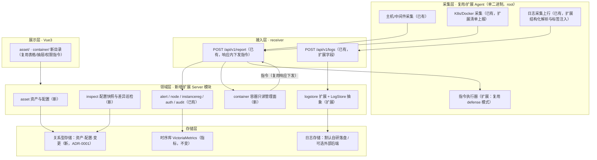

# 一体化运维平台总体设计（在现有监控平台上演进）

日期：2026-09-30
范围依据：`2026-09-30-ops-platform-capability-map.md`（功能全景与实现状态对照表，本次评审卡点）
配套详设：`2026-09-30-asset-cmdb-design.md`（资产与配置）、`2026-09-30-container-observability-design.md`（容器与可观测）
决策记录：`docs/adr/0001-cmdb-relational-store.md`、`docs/adr/0002-log-backend-abstraction.md`、`docs/adr/0003-container-management-downlink.md`

## 意图与边界

**意图**：在现有 nebula-monitor（Go Server + 自研 Agent + VictoriaMetrics + 告警引擎 + RBAC/离线包）之上补齐「模型、关系、变更、操作面、索引」五类能力，使其从**监控平台**演进为**一体化运维平台**。首批两条主线（已确认）：

1. **资产与配置**：资产台账、自动发现与关系拓扑、变更历史、配置快照与差异巡检
2. **容器与可观测**：K8s/容器只读管理面、容器排障、日志结构化与检索、日志后端可替换

**边界**（不做的事，避免范围蔓延）：

- **不新起仓库、不换技术栈**：沿用 Go 单二进制 Server/Agent + systemd、Vue3 + Vite、VictoriaMetrics、离线 full/upgrade 双包。
- **不改动现有语义**：告警 firing/Ack 两套状态机、三层静默/抑制/分组/收敛、资源范围服务端强校验、审计类别与动作、指标保留期归属时序库——本次只**扩展**（新增权限点、新增范围维度），不重定义。
- **不引入需外网或重量级依赖**：默认只借开源**设计思想**；代码级复用仅限 Apache-2.0/MIT 集合（依据见调研报告 §三 许可合规）。
- **非目标（明确推迟）**：链路追踪（P3，需应用侧侵入，路线见 §风险与取舍）、堡垒机/PAM 会话代理（P3）、工单/审批引擎（P2）、应用发布流水线（P3）、移动端与 i18n（P3）。

## 现状与依据

### 2.1 采集侧：能力已存在，缺"模型化"

- 主机/硬件/分区/进程：`internal/agent/collector/hostinfo.go`
- 容器/K8s 指标：`internal/agent/collector/k8s.go:collectPods/collectWorkloads`（只读 GET apiserver）、`internal/agent/collector/docker.go`
- 日志采集与上行：`internal/agent/collector/logcollect.go:mergeMultiline`、`internal/agent/logship/ship.go:Shipper.send`（`POST /api/v1/logs`）
- 安全检测（SSH/sudo/FIM/基线）：`internal/agent/collector/security.go`
- 结论：**资产信息其实已经在采集**，缺的是资产模型、关系、变更历史与生命周期（见对照表 §3.2）。

### 2.2 存储侧：三层已成型，缺"关系型"

- 指标：`internal/server/storage/vm.go:Storage` 接口（`Write / QueryRange / QueryLatest / QueryInstant / QueryInstantWithLookback / QueryAllLatest / Backend`），默认 VictoriaMetrics，可切 Prometheus/Mimir/Cortex/Thanos。
- 日志：`internal/server/logstore/query.go:Store.Query` + `internal/server/receiver/logs.go:HandleLogs`；游标 `Cursor{File,Offset}`（文件内绝对字节偏移），扫描预算 `DefaultScanBudgetBytes`（64MiB）、`DefaultScanBudgetLines`（200000），返回 `Truncated` + 续读游标。**无全文索引、无字段解析**。
- 本地状态：JSON 文件落盘（告警处置 `alert_acks.json`、保留策略 `retentionFile`、安全事件 `security_store.json`、看板 `dashboards.yaml` 等），审计/安全事件按内置上限淘汰。
- 结论：**"Server 完全无状态"只指指标数据归时序库**；本地持久化早已存在，因此为资产引入关系型存储是**同层演进**，不是定位改变（ADR-0001）。

### 2.3 下行通道：已有先例，可直接复用（关键依据）

现有两条 Server→Agent 指令链路，**协议、协商、回执、过期一应俱全**：

| 环节 | 证据 |
|---|---|
| 响应载体 | `internal/server/receiver/receiver.go:HandleReport`（`resp := map[string]interface{}{"status":"ok"}`，随后注入 `resp["command"]="upgrade"`、`resp["defense"]=cmd`） |
| Agent 侧结构 | `internal/agent/reporter/reporter.go:ReportResponse{Status, Command, Defense *model.DefenseCommand}`（注释明确"旧 Agent 不消费、旧 Server 不返回，双向兼容"） |
| 能力协商 | `receiver.go`：仅当 `payload.Capabilities.Defense` 为真才下发（`defense.SaveCap`） |
| 指令队列 | `internal/server/security.DefenseStore`：`Take(node)`（领取）、`ExpireOverdue()`（超时作废） |
| 执行回执 | `payload.DefenseResult{CommandID, State, Message}` → `defense.UpdateResult(...)` |
| 执行侧 | `internal/agent/defense/executor.go:Executor.Execute` |
| 升级另路 | `internal/server/node/manager.go:ConsumeUpgrade` + `internal/agent/upgrader/upgrader.go:Run` |

**结论**：容器管理面的下行操作**必须复刻这一模式**（结构化指令 + 能力协商 + 回执 + 过期），而不是新建长连接/新协议。原因不是"省事"，而是：凭据（kubeconfig/token）**只存 Agent 本地、不上报**（`internal/model/metric.go` 的 `K8sInstanceConfig` 注释），Server **无法直连 apiserver**，操作只能由 Agent 执行。

### 2.4 权限与审计：机制完备，需扩展维度

- 包装器与范围校验：`internal/server/api/auth.go:permit / permitNode / permitHostname / authz / checkPerm / checkNodeScope / checkNodeTarget / denyScope / RecordPermissionDenied`
- 范围过滤：`internal/server/auth/policy.go:FilterGroups / FilterByGroup / CheckBatchGroups`、`Principal.CanAccessGroup`
- 权限点目录：`internal/server/auth/model.go:PermissionCatalog()`；现有前缀域：`dashboard / nodes / groups / alerts / notify / silence / probe / report / metrics / middleware / security / agent / system / audit / users / roles / logs`
- 高风险标记：`internal/server/auth/policy.go:HighRiskPermissions`
- 审计：`internal/server/api/audit.go:AuditMiddleware`（只记管理写请求）+ `RecordLoginAudit / RecordChangeAudit / RecordPermissionDenied`

### 2.5 前端与交付形态

- 页面：顶层 `web/src/components/{LoginView,OverviewView,HostsView,NodeView,MiddlewareView,AlertsView,DialTestView,ReportView,UpgradeView,NotifyView,SecurityView,LogsView,AuditView,StatusView}.vue`；子目录按类型（`k8s/ docker/ mysql/ redis/ … screen/ dashboard/ rbac/ settings/`）。**无 `asset/`、无 `container/`**。
- 路由注册：`internal/server/api/query.go:RegisterRoutes`（约 140 条 `/api/v1/*`），另有 `cmd/server/main.go` 注册 `POST /api/v1/report|logs`、`api/ws.go:RegisterWS`、`agentdist/agentdist.go:Distributor.Register`。
- 离线交付：`build/fetch-packages.sh`（离线依赖缓存）+ `build/release.sh`（full + upgrade 双包）+ `deploy/install-server.sh|agent-install.sh|install-tsdb.sh`。

### 2.6 已发现的文档滞后项（必须一并修订）

**采集项模板（Collector Template）与取数护栏（templateGuards）已被移除**：

- 移除提交：`1e25239 refactor!: 移除采集项模板功能全链路`
- 代码事实：`internal/template` 目录不存在；`internal/server/api/query.go` 无 `middleware/templates` 注册
- 文档滞后：`CONTEXT.md` 仍有 **7 处**按现役术语描述；`docs/c1-collector-templates.md`、`docs/refactor-plan.md`、`docs/permission-matrix.md` 亦按已交付描述

处置：在本计划的「术语与路线图同步」步骤中修订，**不得**在新设计中继续引用该功能为现有能力。

## 目标架构与模块划分



### 3.1 新增模块与职责边界（深模块：小接口 + 厚实现）

| 模块（包） | 对外接口（小） | 藏在内部的复杂度 | 依赖方向 |
|---|---|---|---|
| `internal/server/asset` | `Service`：`Upsert(发现来源) / Get / List(query) / Link / Unlink / Snapshot / Diff / History` | 类型系统与属性校验、采集值与人工值合并、关系一致性、变更 diff 与留痕、审计写入、范围裁剪 | ← 依赖 `store`（关系库）、`auth`（范围）、`audit` |
| `internal/server/inspect` | `Service`：`Run(scope) / Report(id) / ListRuns` | 快照采集编排、合规模板比对、差异分级、结果留存 | ← 依赖 `asset`、`security`（基线复用） |
| `internal/server/container` | `Service`：`List / Describe / Events / Logs`（读）；`Exec`（写，受护栏，P2） | 指令构造与下发、结果组装、超时与过期、结果缓存、权限与审计 | ← 依赖 `channel`、`asset`（可选绑定）、`auth/audit` |
| `internal/server/channel` | `Dispatch(node, cmd) / Pending(node) / Result(node, res)` | 队列与过期、能力协商、幂等与重试语义、审计 | ← 被 `container`（及未来作业模块）复用；由 `receiver` 消费 |
| `internal/server/logstore`（扩展） | 抽出 `LogStore` 接口：`Write`、`Query(model.LogQuery, Cursor)`、`Backend()` | 分片落盘、扫描预算、游标语义、上限与丢弃原因 | 现有 `Store` 作为默认适配器；外部后端为新适配器 |

**设计要点（seam 纪律）**：

- `LogStore` 的接口**必须沿用现有方法名 `Query`** 与既有参数/返回类型（`internal/server/logstore/query.go:Store.Query`、`model.LogQuery`），不得另造 `Retrieve(...)` 之类签名——接口就是调用方与测试共同的接缝，改名会造成两套语义。
- 目前日志只有**一个**适配器（自研落盘），按"一个适配器只是假想接缝"的纪律，`LogStore` 接口**随第二个适配器（VictoriaLogs）一起引入**，不提前抽象（ADR-0002）。
- `channel` 是把既有"响应内下发指令"模式**收敛成模块**（当前 `upgrade` 与 `defense` 各写一套）：这是典型的 deepening——把队列、过期、能力协商、回执归拢到一处，`container` 与未来的批量作业都复用，符合 deletion test（删掉它，复杂度会在多个调用方重现）。
- 资产范围（业务/资产分组）与节点分组范围**并存**：`asset` 内部把"资产 → 所属节点"映射到既有节点分组，范围校验仍走 `api/auth.go` 的包装器，**服务端强校验，绝不退化为前端隐藏**。

### 3.2 存储分层结论

| 数据 | 存储 | 本次动作 |
|---|---|---|
| 指标 | VictoriaMetrics（`storage.Storage`） | 不变 |
| 日志 | 默认自研分片落盘；可选外部后端 | 抽出 `LogStore` 接口 + 第二适配器（ADR-0002） |
| 资产 / 配置项 / 关联 / 变更历史 | **关系型存储**（内嵌 SQLite，`modernc.org/sqlite`，纯 Go 无 CGO） | 新建（ADR-0001） |
| 告警处置 / 安全事件 / 审计 / 看板 | 现有 JSON 落盘 | 不变（不迁移，避免无收益的搬家） |

## 复用边界表

| 能力 | 判定 | 理由与依据 |
|---|---|---|
| Agent 主机/中间件/容器采集 | **复用** | 已实现且稳定（`internal/agent/collector/*`）；资产自动发现直接消费既有产物 |
| 日志采集（含多行合并/限速/偏移） | **复用** | `internal/agent/logship`、`logcollect.go:mergeMultiline` 已满足采集侧；本次只在采集结果上加**结构化解析与标签注入** |
| 日志检索（游标/预算/truncated） | **扩展** | `logstore/query.go:Store.Query` 语义正确，本次加字段过滤与解析，不改分页语义 |
| 告警引擎与通知 | **复用** | 状态机/静默/抑制/分组/收敛/升级/处置完整；只新增"告警 ↔ 资产"关联 |
| 权限/审计 | **扩展** | 复用包装器与审计类别；新增权限点（`assets:*`、`container:*`）与资产范围维度 |
| 资源范围 | **扩展** | 现有范围=节点分组；资产需映射到分组，保持服务端强校验 |
| Server/Agent 升级 | **复用** | `upgrade.Manager`、`agent/upgrader`；容器/资产能力随版本发布 |
| 下行指令通道 | **扩展（收敛）** | 复用 `resp["command"|"defense"]` 模式与能力协商；收敛为 `channel` 模块（见 §3.1） |
| 资产台账 / 关系 / 变更 | **新建** | 代码中无对应实现（对照表 §3.2） |
| 容器只读管理面 | **新建** | Server 侧无 `*k8s*` handler（对照表 §3.8）；官方 Dashboard 已归档、KubeOperator 已归档、Kuboard 仓库 404（调研报告 §2.2） |
| 配置快照与差异巡检 | **新建** | 现有 FIM 仅文件哈希（`security.go:loadFIMBaseline/sha256File`），非配置项级 diff |
| 链路追踪 | **不做（P3）** | 需应用侧探针/SDK 侵入，与内网离线 + 轻量定位冲突（调研报告 §2.3） |

## 下行操作通道设计（关键前置）

**协议草案**（复用既有响应承载，不新增连接）：

```
Agent → Server:  POST /api/v1/report        # 携带 Capabilities + 上一条指令的 Result
Server → Agent:  {"status":"ok",
                  "command":"upgrade",                       # 既有
                  "defense":{...},                           # 既有
                  "ops":{ "id":"c-8f2", "kind":"container.logs",   # 新增（与 defense 同构）
                          "params":{...}, "expireAt":1750000000 }}
Agent → Server:  POST /api/v1/report        # 下一轮带回 opsResult{id,state,message,data}
```

**安全护栏（沿用既有三道门控思想，落地为四道）**：

1. **本机护栏**：Agent `agent.yaml` 上的开关（如 `guards.ops.containerLogs / exec`），机器自己掌握是否放行——沿用本项目一贯的动机：**Agent 以 root 运行，Web 上一个写权限 ≈ 一批机器的 root**（该动机最早由已移除的采集项模板护栏提出，见 §2.6）。
2. **能力协商**：仅当 Agent 上报 `Capabilities.Ops` 含该 kind 才下发（对齐 `Capabilities.Defense` 现有做法）。
3. **中心授权 + 审计**：专属权限点（`container:read` / `container:exec`）并纳入 `HighRiskPermissions` 与审计（`AuditMiddleware` + `RecordChangeAudit`）。
4. **默认只读**：首批只放 `container.logs`、`container.events`、`container.describe`；`exec` 需显式开启且单独权限点（P2）。

**兼容性**：旧 Agent 不认 `ops` 字段（`ReportResponse` 仅消费已知字段）→ 不下发；旧 Server 不返回 `ops` → 新 Agent 无待执行指令。与既有注释所声明的"双向兼容"一致。

## 文档与验证

- 本次为**文档任务**：新增 5 份设计/调研文档 + 3 份 ADR，修改 `CONTEXT.md` 与 `README.md`；**不改代码**。
- 验证方式（文档可核性）：
  1. 每处「现状与依据」引用可跳转命中（文件 + 符号）；
  2. 对照表覆盖 `README.md` §路线图 全部条目（对账表），无两套说法；
  3. 新术语写入 `CONTEXT.md` 并在正文中一致使用（无同义词漂移）；
  4. ADR 编号连续、与既有设计无冲突；
  5. 修订「采集项模板」滞后描述（§2.6）。
- 未来实现阶段的验证（供详设引用）：`go test ./...`、`go vet ./...`、`npm --prefix web test`、`npm --prefix web run build`。

## 风险与取舍

| 风险 | 取舍与缓解 |
|---|---|
| 引入关系型存储被质疑"破坏 Server 无状态" | 口径澄清（§2.2）：无状态指指标数据；本地 JSON 落盘早已存在。ADR-0001 记录迁移与备份路径 |
| 内嵌 SQLite 与既有 JSON 数据双轨 | 只把"关系型数据"迁入 SQLite；告警处置/审计/看板等**保持不动**，不做无收益搬迁 |
| 下行通道成为新的攻击面 | 四道护栏 + 默认只读 + 高危权限点 + 审计；`exec` 后置（P2）且需显式开启 |
| 资产数据可信度（自动发现值 vs 人工维护值） | 设计"采集值/人工值分离 + 差异可见"，不做静默覆盖（详设 D2） |
| 引入外部日志后端带来的许可与打包复杂度 | 默认不引入；接口与第二适配器一起落地，VictoriaLogs（Apache-2.0、单二进制、同厂）作为首选候选（ADR-0002） |
| 资产范围与节点分组范围双轨造成权限语义混乱 | 单一映射：资产 → 所属节点 → 既有分组；范围校验仍走既有包装器，不做第二套判定 |
| 链路追踪被反复提起 | 明确 P3 并给路线：若需零侵入可评估 eBPF（调研报告 §2.3 已取证 `deepflowio/deepflow` 4286★ Apache-2.0）；否则走 OTel 网关（需应用侧配合） |
| 文档滞后（采集项模板）误导后续设计 | 已列为必须修订项（§2.6），并在对照表中标注 |
